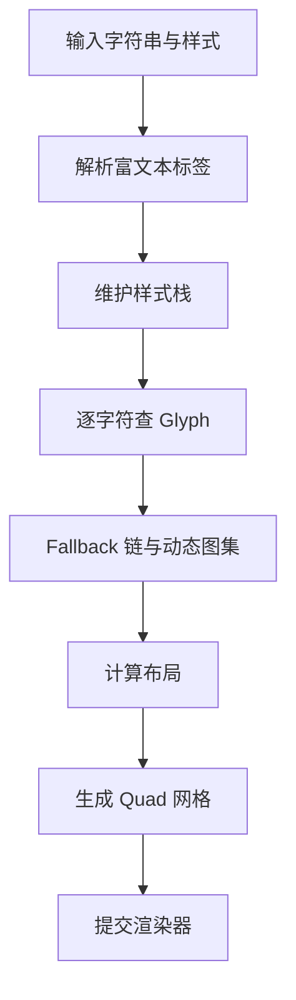

# 文本布局与网格生成管线

> 所属计划: [[plan|Unity 字体系统学习计划]]
> 预计耗时: 90 min
> 前置知识: [[03-font-asset-creation-and-internals|Font Asset 创建与内部结构]], [[04-sdf-rendering-and-shaders|SDF 渲染与 Shader 特效]]

---

## 1. 概念讲解

### 为什么需要这个？

在 Unity 中把字符串显示到屏幕，并不是"贴一张图"那么简单。一段文本从 `string` 变成屏幕上的像素，要经历解析、查字、排版、生成网格、提交渲染等多个阶段。理解这条管线，才能回答以下问题：

- 为什么动态文字修改时会卡顿？
- 为什么 fallback 链上的字会换材质、断 batch？
- 为什么富文本标签写错会导致整段文字消失？
- 为什么我能用 `TMP_Text.textInfo` 拿到每个字符的顶点，却不知道该怎么改？

本章聚焦 **TextCore / TextMeshPro 的文本布局与网格生成管线**，从 `GenerateText` 的入口开始，逐层拆解到顶点属性。

### 核心思想

无论是 UI Toolkit 的 `UnityEngine.TextCore.Text.TextGenerator.GenerateText(settings, textInfo)`，还是 TextMeshPro 中 `TMP_Text` 的 `Rebuild(CanvasUpdate)`，核心流程都遵循同一套模型：


#### 阶段 1：解析富文本标签与样式栈

TMP 与 TextCore 支持以 `<tag>` 形式插入富文本。常见标签包括：

- `<b>` / `</b>`：粗体
- `<i>` / `</i>`：斜体
- `<color=#RRGGBBAA>` / `</color>`：颜色
- `<size=24>` / `</size>`：字号
- `<font="Assets/MyFont.asset">`：切换字体
- `<sprite=0>`：插入 Sprite Asset 图标

解析器从左到右扫描字符串。遇到开标签时，把当前样式**压栈**；遇到闭标签时，从栈顶**弹出**恢复上一状态。这个"栈"保证了嵌套标签不会互相覆盖。

例如：

```text
Hello <color=red>wor<b>ld</b></color>
```
扫描到 `<color=red>` 时，颜色压栈为红色；扫描到 `<b>` 时，粗体压栈；扫描到 `</b>` 时粗体出栈；扫描到 `</color>` 时颜色出栈。最终 `ld` 为红色粗体，`wor` 为红色非粗体。

> [!warning] 标签必须正确闭合
> 未闭合的标签会让解析器无法恢复原始样式，导致后续整段文本颜色/字号异常；在极端情况下，解析器会直接判定整段文本无效而跳过渲染。

#### 阶段 2：Glyph 查找与 Fallback 链

每个可见字符都要映射到一个 **Glyph**。

1. 从当前 `TMP_FontAsset` 的 `characterTable` 中按 Unicode 查找。
2. 未找到则递归查找该 asset 的 **Fallback Font Assets**。
3. 仍未找到则查找全局 fallback、sprite asset、default font asset。
4. 最终仍缺失时，渲染一个"Missing Glyph"占位方块。

如果当前 font asset 是 **Dynamic**，且源 `.ttf` / `.otf` 在 build 中可用，查找缺失字符时会触发运行时**光栅化**，将新 glyph 写入 atlas。这一步会修改 atlas texture，并可能触发材质/网格重建。

> [!note] 动态图集的副作用
> 动态光栅化后，atlas 中该字符对应的 `GlyphRect` 会被更新；如果 atlas 已满，会先扩容或清理。任何 atlas 变化都可能导致同一次 `GenerateText` 调用结束后，材质引用的贴图指针发生变化。

#### 阶段 3：布局计算

拿到所有 glyph 后，进入布局阶段。关键概念：

| 概念 | 说明 |
|------|------|
| `origin` | 字符在当前行上的水平起点。 |
| `xAdvance` | 当前字符占用的水平步进，包含 advance 与 kerning。 |
| `baseLine` | 当前行的基线 Y 坐标。 |
| `ascender` / `descender` | 字形最高点 / 最低点相对基线的偏移，决定行高。 |
| `lineHeight` | 行与行之间的垂直间距，由 font asset face info 的 `lineHeight` × 缩放因子决定。 |
| `kerning` | 特定字符对（如 `AV`、`To`）的额外水平微调。 |
| `word wrapping` | 当累计宽度超过 `rectTransform` 宽度时，在合适位置断行。 |
| `alignment` | 行内对齐（左/中/右/两端对齐）。 |

字距调整（kerning）读取 font asset 中的 `kerningTable` 或 OpenType `GPOS` 数据。TMP 会在当前字符与前一个字符之间查询 kerning pair，调整 `xAdvance`。

换行策略通常按 **word boundary**（单词边界）进行；若某个单词长度超过容器宽度，则会在字符级别强制断行。中文/日文/韩文等 CJK 文本由于不存在空格分隔的"单词"，通常按字符边界断行。

#### 阶段 4：网格生成

布局完成后，每个可见字符会被转换为一个 **Quad（两个三角形，4 个顶点）**。顶点属性包括：

| 属性 | 语义 | 来源 |
|------|------|------|
| `POSITION` / `vertex` | 局部空间四边形坐标 | 由 glyph metrics + 当前 origin/baseLine 计算 |
| `TEXCOORD0` / `uv0` | 在 atlas 中的 UV | 由 `GlyphRect` 计算 |
| `TEXCOORD1` / `uv1` | SDF 距离/轮廓信息 | TMP SDF shader 用它控制 outline、dilate 等 |
| `COLOR` | 顶点色 | 当前样式栈中的颜色，可能与材质 color 相乘 |
| `NORMAL` | 法线 | 主要用于 3D 文字光照计算 |
| `TANGENT` | 切线 | 部分 shader 使用 |

这些顶点被写入 `TextInfo.meshInfo[materialIndex]`。若文本使用了多个 font asset 或 sprite asset，会产生多个 `meshInfo`，每个对应一个 sub-mesh / material。

#### 阶段 5：提交渲染器

- **TextMeshPro (3D)**：将 `meshInfo.mesh` 赋值给 `MeshFilter`，由 `MeshRenderer` 渲染。
- **TextMeshProUGUI**：通过 `CanvasRenderer` 提交顶点到 Canvas batch。
- **UI Toolkit `Label`**：由 TextCore `TextGenerator` 生成 `TextInfo`，再交给 UI Toolkit renderer。

### TMP_CharacterInfo 关键字段

`TMP_Text.textInfo.characterInfo[index]` 保存了每个字符在管线中的完整状态：

| 字段 | 含义 |
|------|------|
| `character` | 原始字符。 |
| `fontAsset` | 实际渲染该字符的 font asset。 |
| `material` / `materialReferenceIndex` | 材质引用与 meshInfo 数组下标。 |
| `pointSize` | 最终渲染字号。 |
| `lineNumber` / `pageNumber` | 所在行号/页号。 |
| `vertexIndex` | 该字符四个顶点在 `meshInfo.vertices` 中的起始索引。 |
| `vertex_BL` / `vertex_TL` / `vertex_TR` / `vertex_BR` | 四边形四个角的完整顶点数据（位置、UV、颜色）。 |
| `bottomLeft` / `topLeft` / `topRight` / `bottomRight` | 仅位置信息。 |
| `uvBottomLeft` / `uvTopLeft` / `uvTopRight` / `uvBottomRight` | 仅 UV0 信息。 |
| `origin` / `xAdvance` / `baseLine` / `ascender` / `descender` | 布局数据。 |
| `isVisible` | 是否生成网格（控制字符、空格、换行等可能为 `false`）。 |

---

## 2. 代码示例

下面提供两个脚本：

1. `TextMeshInfoInspector`：枚举 `TMP_Text.textInfo` 中每个字符，打印其左下角顶点位置、UV 与材质引用。
2. `TextMeshWaveModifier`：在网格生成后修改顶点位置，实现波浪动画。

### 示例 1：读取 TMP_Text.textInfo

```csharp
using TMPro;
using UnityEngine;

public class TextMeshInfoInspector : MonoBehaviour
{
    [SerializeField]
    private TMP_Text tmpText;

    [ContextMenu("Print Character Info")]
    public void PrintCharacterInfo()
    {
        if (tmpText == null)
        {
            tmpText = GetComponent<TMP_Text>();
        }

        // 强制刷新，确保 textInfo 与当前文本一致
        tmpText.ForceMeshUpdate();

        TMP_TextInfo textInfo = tmpText.textInfo;
        int characterCount = textInfo.characterCount;

        Debug.Log($"Character count: {characterCount}");
        Debug.Log($"Mesh info count: {textInfo.meshInfo.Length}");

        for (int i = 0; i < characterCount; i++)
        {
            TMP_CharacterInfo ci = textInfo.characterInfo[i];

            if (!ci.isVisible)
            {
                Debug.Log($"[{i}] '{ci.character}' isVisible=false line={ci.lineNumber}");
                continue;
            }

            TMP_MeshInfo meshInfo = textInfo.meshInfo[ci.materialReferenceIndex];
            int vi = ci.vertexIndex;

            Vector3 bl = meshInfo.vertices[vi + 0];
            Vector3 tl = meshInfo.vertices[vi + 1];
            Vector3 tr = meshInfo.vertices[vi + 2];
            Vector3 br = meshInfo.vertices[vi + 3];

            Vector2 uv0 = meshInfo.uvs0[vi + 0];
            Vector2 uv1 = meshInfo.uvs0[vi + 1];
            Vector2 uv2 = meshInfo.uvs0[vi + 2];
            Vector2 uv3 = meshInfo.uvs0[vi + 3];

            Debug.Log(
                $"[{i}] '{ci.character}' font={ci.fontAsset.name} " +
                $"matIndex={ci.materialReferenceIndex} " +
                $"BL={bl} TL={tl} TR={tr} BR={br} | " +
                $"UV={uv0}/{uv1}/{uv2}/{uv3}"
            );
        }
    }
}
```
### 示例 2：运行时修改网格顶点

```csharp
using TMPro;
using UnityEngine;

public class TextMeshWaveModifier : MonoBehaviour
{
    [SerializeField]
    private TMP_Text tmpText;

    [SerializeField]
    private float waveSpeed = 2f;

    [SerializeField]
    private float waveFrequency = 0.5f;

    [SerializeField]
    private float waveAmplitude = 5f;

    private void Update()
    {
        if (tmpText == null)
        {
            tmpText = GetComponent<TMP_Text>();
        }

        // 先让 TMP 完成一次常规网格生成
        tmpText.ForceMeshUpdate();

        TMP_TextInfo textInfo = tmpText.textInfo;
        float time = Time.time * waveSpeed;

        for (int i = 0; i < textInfo.characterCount; i++)
        {
            TMP_CharacterInfo ci = textInfo.characterInfo[i];
            if (!ci.isVisible)
            {
                continue;
            }

            TMP_MeshInfo meshInfo = textInfo.meshInfo[ci.materialReferenceIndex];
            int vi = ci.vertexIndex;

            // 以字符中心 X 为相位输入
            float centerX = (meshInfo.vertices[vi + 0].x + meshInfo.vertices[vi + 2].x) * 0.5f;
            float offsetY = Mathf.Sin(centerX * waveFrequency + time) * waveAmplitude;

            for (int v = 0; v < 4; v++)
            {
                meshInfo.vertices[vi + v].y += offsetY;
            }
        }

        // 方式 A：通过 textInfo.meshInfo 直接更新对应 mesh
        for (int m = 0; m < textInfo.meshInfo.Length; m++)
        {
            Mesh mesh = textInfo.meshInfo[m].mesh;
            if (mesh != null)
            {
                mesh.vertices = textInfo.meshInfo[m].vertices;
                mesh.UploadMeshData(false);
            }
        }

        // 方式 B（仅适用于 3D TextMeshPro）：
        // MeshFilter meshFilter = tmpText.meshFilter;
        // if (meshFilter != null)
        // {
        //     meshFilter.mesh.vertices = textInfo.meshInfo[0].vertices;
        // }
    }
}
```
> [!warning] 不要直接修改 MeshFilter.sharedMesh
> `MeshFilter.sharedMesh` 指向 asset 资源本身，运行时修改会污染项目资产。应使用 `meshFilter.mesh`（实例副本）或通过 `textInfo.meshInfo[].mesh` 修改。

**运行方式:**

1. 新建 Unity 项目（建议 2022.3 LTS 或更新版本）。
2. 通过 Package Manager 安装 `TextMeshPro`（通常已内置）。
3. 导入中文字体并创建 `TMP_FontAsset`（参见 [[03-font-asset-creation-and-internals|Font Asset 创建与内部结构]]）。
4. 在场景中创建一个 `TextMeshPro` 3D 对象或 `TextMeshPro - Text (UI)`。
5. 将上述脚本挂到该对象上，并把 `TMP_Text` 字段拖到 Inspector。
6. 对于 `TextMeshInfoInspector`，在 Inspector 右键脚本组件选择 `Print Character Info`。
7. 对于 `TextMeshWaveModifier`，直接 Play 即可看到波浪动画。

**预期输出:**

```text
Character count: 12
Mesh info count: 1
[0] 'H' font=SourceHanSans matIndex=0 BL=(-96.0, -10.0, 0.0) ... UV=(0.123,0.456)/...
[1] 'e' font=SourceHanSans matIndex=0 BL=(-80.0, -10.0, 0.0) ... UV=...
...
[10] ' ' isVisible=false line=0
```
---

## 3. 练习

### 练习 1: 基础 — 打印每行文字的边界框

扩展 `TextMeshInfoInspector`，在 `PrintCharacterInfo` 中额外计算并输出每一行的 `minX`、`maxX`、`minY`、`maxY`，即该行所有可见字符的包围盒。

### 练习 2: 进阶 — 按字符索引高亮某个字

编写脚本，接收一个整数 `highlightIndex`。在 `TMP_Text` 生成网格后，把该索引对应字符的四个顶点颜色改为红色，其余保持白色。要求通过 `textInfo.meshInfo[].colors32` 修改，并调用 `mesh.UploadMeshData(false)` 更新。

### 练习 3: 挑战 — 实现逐字缩放动画（可选）

不修改 `TMP_Text.text`，而是每帧根据时间对每个可见字符的四个顶点做以该字符中心为原点的缩放动画。提示：先计算字符中心，将每个顶点平移到以中心为原点，缩放，再平移回去。

---

## 3.5 参考答案

> [!tip]- 练习 1 参考答案
> 在遍历 `characterInfo` 时，按 `lineNumber` 聚合每个字符的 `bottomLeft.x`、`bottomRight.x`、`bottomLeft.y`、`topLeft.y`。
>
> ```csharp
> var lineBounds = new Dictionary<int, (float minX, float maxX, float minY, float maxY)>();
>
> for (int i = 0; i < textInfo.characterCount; i++)
> {
>     var ci = textInfo.characterInfo[i];
>     if (!ci.isVisible) continue;
>
>     var meshInfo = textInfo.meshInfo[ci.materialReferenceIndex];
>     int vi = ci.vertexIndex;
>     float minX = meshInfo.vertices[vi + 0].x;
>     float maxX = meshInfo.vertices[vi + 2].x;
>     float minY = meshInfo.vertices[vi + 0].y;
>     float maxY = meshInfo.vertices[vi + 1].y;
>
>     if (!lineBounds.ContainsKey(ci.lineNumber))
>         lineBounds[ci.lineNumber] = (minX, maxX, minY, maxY);
>     else
>     {
>         var b = lineBounds[ci.lineNumber];
>         lineBounds[ci.lineNumber] = (
>             Mathf.Min(b.minX, minX),
>             Mathf.Max(b.maxX, maxX),
>             Mathf.Min(b.minY, minY),
>             Mathf.Max(b.maxY, maxY)
>         );
>     }
> }
>
> foreach (var kv in lineBounds)
> {
>     Debug.Log($"Line {kv.Key}: bounds={kv.Value}");
> }
> ```

> [!tip]- 练习 2 参考答案
> 修改 `colors32` 数组后上传 mesh。
>
> ```csharp
> public void HighlightCharacter(int index)
> {
>     tmpText.ForceMeshUpdate();
>     var textInfo = tmpText.textInfo;
>
>     for (int m = 0; m < textInfo.meshInfo.Length; m++)
>     {
>         var meshInfo = textInfo.meshInfo[m];
>         for (int c = 0; c < textInfo.characterCount; c++)
>         {
>             var ci = textInfo.characterInfo[c];
>             if (ci.materialReferenceIndex != m || !ci.isVisible) continue;
>
>             int vi = ci.vertexIndex;
>             Color32 target = (c == index) ? Color.red : Color.white;
>             for (int v = 0; v < 4; v++)
>             {
>                 meshInfo.colors32[vi + v] = target;
>             }
>         }
>
>         meshInfo.mesh.colors32 = meshInfo.colors32;
>         meshInfo.mesh.UploadMeshData(false);
>     }
> }
> ```

> [!tip]- 练习 3 参考答案（可选）
> 以字符中心为原点做缩放。
>
> ```csharp
> Vector3 center = (meshInfo.vertices[vi + 0]
>                 + meshInfo.vertices[vi + 1]
>                 + meshInfo.vertices[vi + 2]
>                 + meshInfo.vertices[vi + 3]) * 0.25f;
>
> float scale = 1f + 0.3f * Mathf.Sin(Time.time * 3f + i);
>
> for (int v = 0; v < 4; v++)
> {
>     Vector3 local = meshInfo.vertices[vi + v] - center;
>     local *= scale;
>     meshInfo.vertices[vi + v] = center + local;
> }
> ```

> [!note] 答案使用方式
> 先独立完成练习，再展开查看参考答案。参考答案不是唯一解——如果你的实现通过了测试或达到了题目要求，就是正确的。

---

## 4. 扩展阅读

- [TextMeshPro Scripting API: TMP_Text.textInfo](https://docs.unity3d.com/Packages/com.unity.textmeshpro@3.2/api/TMPro.TMP_Text.html#TMPro_TMP_Text_textInfo)
- [TextMeshPro Scripting API: TMP_TextInfo](https://docs.unity3d.com/Packages/com.unity.textmeshpro@3.2/api/TMPro.TMP_TextInfo.html)
- [TextMeshPro Scripting API: TMP_CharacterInfo](https://docs.unity3d.com/Packages/com.unity.textmeshpro@3.2/api/TMPro.TMP_CharacterInfo.html)
- [TextMeshPro Scripting API: TMP_MeshInfo](https://docs.unity3d.com/Packages/com.unity.textmeshpro@3.2/api/TMPro.TMP_MeshInfo.html)
- [UnityCsReference TextGenerator.cs](https://github.com/Unity-Technologies/UnityCsReference/blob/master/Modules/TextCoreTextEngine/Managed/TextGenerator.cs)
- [TextMeshPro Rich Text Tags](https://docs.unity3d.com/Packages/com.unity.textmeshpro@3.2/manual/RichText.html)
- [TextMeshPro Fallback font assets](https://docs.unity3d.com/Packages/com.unity.textmeshpro@3.2/manual/FontAssetsFallback.html)
- [UI Toolkit Text best practices](https://docs.unity3d.com/Manual/best-practice-guides/ui-toolkit-for-advanced-unity-developers/text.html)

---

## 常见陷阱

- **错误**: 在 `Update` 中直接修改 `tmpText.text` 实现逐字动画。
  **正确做法**: 频繁修改 `text` 会触发完整管线重建。应在 `TMP_Text.text` 不变的前提下，仅修改 `textInfo.meshInfo[].vertices`。

- **错误**: 使用 `meshFilter.sharedMesh.vertices = ...`。
  **正确做法**: 使用 `meshFilter.mesh` 或 `textInfo.meshInfo[].mesh`，确保修改的是实例副本。

- **错误**: 修改 `vertices` 后忘记调用 `mesh.UploadMeshData(false)` 或重新赋值 `mesh.vertices`。
  **正确做法**: 需要把修改后的数组重新写回 `Mesh`，并调用 `UploadMeshData(false)` 让 GPU 侧同步；对于 TMP，通常 `textInfo.meshInfo[m].mesh.vertices = textInfo.meshInfo[m].vertices` 即可。

- **错误**: 假设所有字符在 `meshInfo[0]` 中。
  **正确做法**: 通过 `TMP_CharacterInfo.materialReferenceIndex` 访问正确的 sub-mesh；使用多个 font asset 或 sprite 时，一个 `TMP_Text` 可能包含多个 `meshInfo`。

- **错误**: 对 `isVisible = false` 的字符（如空格、控制字符）访问顶点。
  **正确做法**: 在读取 `vertices` 前始终检查 `ci.isVisible`。

- **错误**: 富文本标签写错后不知道怎么调试。
  **正确做法**: 开启 TMP 的 `Overflow` 检查与 `Debug` 模式；先写纯文本确认布局正常，再逐步添加标签；注意标签必须正确闭合。

- **错误**: 认为 kerning 对中文很重要。
  **正确做法**: 中文等 CJK 字体通常没有 kerning pair；拉丁字母、数字和符号的 kerning 对排版质量影响更大。

- **错误**: 动态图集爆掉后只增大 atlas size。
  **正确做法**: 先评估字符集是否可控；对固定文本使用 static atlas，对动态输入使用受限字符集，并把 emoji/CJK 拆分到专用 fallback asset。
