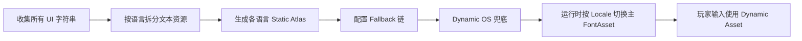

# 动态图集、Fallback 链与本地化

> 所属计划: [[plan|Unity 字体系统学习计划]]
> 预计耗时: 75 min
> 前置知识: [[03-font-asset-creation-and-internals|Font Asset 创建与内部结构]], [[05-text-layout-and-mesh-generation|文本布局与网格生成管线]]

---

## 1. 概念讲解

### 为什么需要这个？

在 Unity 中导入一个字体文件后，TextMeshPro / TextCore 会把它烘焙成一张纹理图集（atlas）。如果只做英文 UI，预烘焙 128 个 ASCII 字符到一张 512×512 的静态图集里就万事大吉。但真实项目几乎立刻会遇到三类需求：

1. **用户输入**：聊天框、角色命名、搜索框里输入的字符无法预先知道。
2. **多语言/生僻字符**：简体中文常用字约 7000 个，繁体、日文、韩文、emoji、生僻符号合起来动辄数万字符。
3. **平台差异**：iOS / Android / Windows / macOS / 主机上的系统 emoji 字形、字形版本、授权都不同。

把整张 CJK 表烤进一张静态图集会吃掉几十 MB 显存和包体，并且仍然漏掉玩家输入的生僻字。把什么都交给运行时动态生成，则会在输入瞬间触发图集扩容、网格重建和 GC，造成掉帧。

因此需要一个组合策略：

- **静态图集（Static）**：对已知、高频、性能敏感的字符串做预烘焙。
- **动态图集（Dynamic）**：对玩家输入等不可预知的字符做运行时按需光栅化。
- **Dynamic OS**：把系统字体作为最后的 fallback，不打包源字体。
- **Fallback 链**：把多个专用图集串起来，让 TMP 在主图集缺字时自动找下一个。
- **Multi Atlas Textures**：当单张图集放不下时自动拆分多张贴图。
- **本地化（Localization）**：根据 `LocalizationSettings.SelectedLocale` 切换主字体或整条 fallback 链。

本章就是把这些机制串成一套可落地的工程方案。

### 核心思想

#### Population Mode：Static vs Dynamic vs Dynamic OS

在 **Font Asset Creator** 窗口的 `Atlas Population Mode` 下拉框里有三种模式：

| 模式 | 烘焙时机 | 是否打包源字体 | 适用场景 |
|------|---------|---------------|---------|
| **Static** | 构建时一次性烘焙 `Character Set` 里指定的字符 | 不必须 | 已知文本、标题、固定 UI 文案、HUD 常驻文字 |
| **Dynamic** | 运行时需要某个字符时才光栅化 | **必须** 打包 `.ttf/.otf` 源文件 | 玩家输入、不可预见的字符、开发期不确定文案 |
| **Dynamic OS** | 运行时向操作系统请求字形 | 不打包源字体 | fallback 末级、系统 emoji、平台特有字符 |

> [!note]
> Dynamic 模式会把源字体文件随包发布，因此需要注意字体授权（font license）是否允许再分发。Dynamic OS 不打包字体文件，字形由操作系统提供，授权风险最小，但不同平台渲染结果可能不一致。

Dynamic 模式的核心流程：

1. `TMP_Text.SetText()` / `text = ...` 解析字符串。
2. 对每个 Unicode 码点，先在当前 `TMP_FontAsset` 的 character table 中查找。
3. 找不到且当前 asset 是 Dynamic，则调用 `TMP_FontAsset.TryAddCharacters(...)` 向 atlas 请求添加该字符。
4. 如果 atlas 还有空位，把字形光栅化并写入；如果没空位，触发 atlas 扩容（创建更大的纹理并拷贝旧数据）。
5. 网格生成管线拿到新 glyph 的 metrics/rect，生成 quad。
6. 在后续 `Update` 中，`TMP_FontAsset.UpdateFontAssetsInUpdateQueue()` 处理异步上传和材质刷新。

Dynamic OS 与 Dynamic 的区别在于：Dynamic OS 不读取项目里的 `.ttf`，而是调用系统字体接口（`FontEngine.LoadFontFace` 的系统路径）生成临时 `FontFace` 和临时 `TMP_FontAsset`。因此它非常适合作为 fallback 链的最后一环：

```text
主字体（Static 或 Dynamic）
  → 专用 fallback（Static：CJK/emoji）
    → Dynamic OS fallback（系统字体 / emoji）
```
#### Dynamic Atlas 的扩容机制

TMP 的 Dynamic atlas 本质上是一块可写的 `Texture2D`，其尺寸在 Font Asset Creator 里由 `Atlas Width / Height` 指定。当运行时光栅化一个字符时，会执行以下逻辑（简化版）：

```text
TryAddCharactersInternal(unicode)
  → 用 FontEngine 光栅化 glyph
  → 调用 FontEngine.TryPackGlyphInAtlas 尝试把 glyph 放进剩余空间
  → 如果放不下：
       1. 创建一张两倍大的新 Texture2D（直到最大尺寸上限）
       2. 把旧 atlas 的像素 blit 到新纹理
       3. 更新所有已有 glyph 的 GlyphRect
       4. 重新尝试 pack 新 glyph
  → 写入新 glyph
  → 把字体资产加入 UpdateQueue
```
扩容的代价很高：

- 需要分配新的 GPU 纹理（旧纹理 garbage 后由 GC / GPU driver 回收）。
- 所有已有 glyph 的 UV 坐标要改变，因此 **所有引用该字体的 Text 组件都需要重新生成网格**。
- 大纹理的 `Graphics.CopyTexture` / `SetPixels32` 在低端机上是毫秒级开销。

`TMP_FontAsset.UpdateFontAssetsInUpdateQueue()` 是 TMP 内部在每帧 `Update` 调用的静态方法，用来统一刷新队列中 font asset 的 material 和 atlas texture。它做的事大致包括：

- 把已经 pack 好但还没上传的新 glyph 像素 `SetPixels32` 到 atlas texture。
- 调用 `m_AtlasTexture.Apply()` 上传到 GPU。
- 如果启用了 SDF，可能还需要更新 material 的 `_MainTex` 引用（当启用了 Multi Atlas Textures 时）。

在 Editor 下，TMP 的 `TMPro_EventManager` 会每帧调用它；在 Player 中由 `TMP_UpdateManager` 或 `TMP_SubMeshUI` 的更新管线触发。自己写工具时通常不需要手动调用，但理解它有助于判断“为什么我的动态文字第一帧是方块，第二帧才显示出来”——因为光栅化发生在网格生成之后，上传发生在下一帧的 `UpdateFontAssetsInUpdateQueue`。

#### TextMeshPro Fallback 链顺序

当 TMP 遇到一个字符在当前字体里找不到时，会按照固定顺序搜索。这个顺序在源码里由 `TMP_Text.GetSpecialCharacters` / `GetFontAssetForWeight` 与 `TMP_FontAssetUtilities` 共同实现，可概括为：

```text
1. 主 Font Asset（Primary Font Asset）
2. 主 asset 的 Fallback Font Assets 列表（递归查找每条链）
3. 当前 TMP_Text 的 Sprite Asset（按 Unicode / sprite name 匹配）
4. TMP Settings 中的 Global Fallback Font Assets（递归）
5. Default Sprite Asset（TMP Settings -> Default Sprite Asset）
6. Default Font Asset（TMP Settings -> Default Font Asset）
7. Missing Glyph 占位方块（□）
```
> [!note]
> 第 3 步“Sprite Asset”容易被忽略。TMP 的 Sprite Asset 里的每个 sprite 可以绑定一个 Unicode 码点，因此如果主字体缺 emoji，可以先在 sprite asset 里提供一组位图 emoji，再走到全局 fallback。

在 Font Asset 的 Inspector 中，`Fallback Font Assets List` 就是第二步；`Project Settings -> TextMeshPro -> Default Font Asset` 是第六步。合理配置这两处就能覆盖绝大多数缺字情况。

#### CJK 与 emoji 的拆分策略

CJK 统一表意文字（CJK Unified Ideographs）大约有 100,000 个码点，常用仅 7,000 左右。把所有 CJK 烤进一张静态图集既不现实也不经济。推荐做法：

1. **按语言拆分**：
   - `Font_ZHS_Static`：简体中文常用字（如 GB2312 6763 字 + 常用标点）。
   - `Font_ZHT_Static`：繁体中文补充字。
   - `Font_JP_Static`：日文假名 + 常用汉字（JIS 第 1/2 水准）。
   - `Font_KR_Static`：韩文 Hangul 音节（常用 2,350 个）。

2. **按字符类型拆分**：
   - 主字体：项目主要语言的高频字，Static。
   - CJK fallback：Dynamic，预置常用字符集，扩容上限调高。
   - Emoji fallback：Dynamic OS，或专门的彩色 Sprite Asset。
   - 符号/数学 fallback：Static 小图集。

3. **使用 Dynamic OS 作为兜底**：
   - 对生僻字、系统 emoji、未预烘焙的字符，把 Dynamic OS font asset 放在 fallback 链末尾。
   - 注意 Dynamic OS 在不同平台可能找不到同名字体，因此在发布前要在目标平台实测。

#### Multi Atlas Textures

在 Font Asset Creator 的 `Generation Settings` 里可以勾选 **Multi Atlas Textures**。启用后，TMP 不再把单张 atlas 扩容成更大的纹理，而是生成第二张、第三张 atlas texture 来容纳新增 glyph。这带来两个好处：

- 避免单张纹理超过 GPU 最大尺寸或造成显存碎片。
- 新增字符不需要重新计算所有已有 glyph 的 UV，旧 mesh 不需要全部重建。

代价是 draw call 增加：一个 `TMP_Text` 如果同时使用了第 0 张和第 1 张 atlas 上的字符，TMP 会生成一个 `TMP_SubMeshUI`（UI）或 `TMP_SubMesh`（3D）来渲染第二张 atlas，这通常意味着额外一次 draw call。因此 Multi Atlas 适合字符集确实很大的场景（例如全 CJK），不适合“为了保险一直开着”。

在材质层面，主 material 的 `_MainTex` 指向 atlas 0，SubMesh 使用各自的 material 指向 atlas 1、2…。这也是为什么有时在 Frame Debugger 里会看到一个 Text 组件被拆成多个 draw call。

#### 本地化工作流

推荐的多语言字体工作流：


具体步骤：

1. **文案锁定后预烘焙**：用 Localization 表导出所有可能出现的字符串，统计字符频率。高频字放进 Static atlas，低频字交给 Dynamic fallback。
2. **主字体按语言配置**：在 `TMP_FontAsset` 的 `Fallback Font Assets` 里挂对应语言的 fallback，不要把所有语言都塞进同一张图集。
3. **运行时切换**：监听 `LocalizationSettings.SelectedLocaleChanged`，根据 `Locale.Identifier.Code` 把 `TMP_Text.font` 或 `TMP_Text.fontSharedMaterial` 换成对应语言的 font asset。
4. **输入框特殊处理**：聊天框、命名框等使用 Dynamic 主字体，并确保其 fallback 链包含 CJK Static + Dynamic OS，避免玩家输入时频繁扩容。

---

## 2. 代码示例

下面给出两个可直接使用的脚本：

1. **Editor 脚本**：批量为一个或多个 `TMP_FontAsset` 配置 fallback 链。
2. **Runtime 脚本**：监听 Localization 的 `SelectedLocaleChanged`，自动切换当前 `TMP_Text` 的字体。

### 2.1 Editor：配置 Fallback 链

```csharp
// Assets/Editor/TMPFallbackChainSetup.cs
using System.Collections.Generic;
using UnityEngine;
using UnityEditor;
using TMPro;

public class TMPFallbackChainSetup : EditorWindow
{
    [SerializeField] private TMP_FontAsset primaryFont;
    [SerializeField] private List<TMP_FontAsset> fallbackChain = new List<TMP_FontAsset>();

    [MenuItem("Tools/TextMeshPro/配置 Fallback 链")]
    private static void Open()
    {
        GetWindow<TMPFallbackChainSetup>("Fallback 链配置");
    }

    private void OnGUI()
    {
        EditorGUILayout.LabelField("主字体与 Fallback 链", EditorStyles.boldLabel);
        primaryFont = (TMP_FontAsset)EditorGUILayout.ObjectField(
            "主字体", primaryFont, typeof(TMP_FontAsset), false);

        EditorGUILayout.Space(5);
        EditorGUILayout.LabelField("Fallback 顺序（从上到下）", EditorStyles.label);

        for (int i = 0; i < fallbackChain.Count; i++)
        {
            EditorGUILayout.BeginHorizontal();
            fallbackChain[i] = (TMP_FontAsset)EditorGUILayout.ObjectField(
                $"[{i}]", fallbackChain[i], typeof(TMP_FontAsset), false);
            if (GUILayout.Button("▲", GUILayout.Width(25)) && i > 0)
                (fallbackChain[i], fallbackChain[i - 1]) = (fallbackChain[i - 1], fallbackChain[i]);
            if (GUILayout.Button("▼", GUILayout.Width(25)) && i < fallbackChain.Count - 1)
                (fallbackChain[i], fallbackChain[i + 1]) = (fallbackChain[i + 1], fallbackChain[i]);
            if (GUILayout.Button("×", GUILayout.Width(25)))
                fallbackChain.RemoveAt(i--);
            EditorGUILayout.EndHorizontal();
        }

        if (GUILayout.Button("+ 添加 Fallback"))
            fallbackChain.Add(null);

        EditorGUILayout.Space(10);
        GUI.enabled = primaryFont != null;
        if (GUILayout.Button("写入 Fallback 链"))
            ApplyFallbackChain();
        GUI.enabled = true;
    }

    private void ApplyFallbackChain()
    {
        Undo.RecordObject(primaryFont, "设置 TMP Fallback 链");

        // 用 SerializedObject 修改私有字段 m_FallbackFontAssetTable
        SerializedObject so = new SerializedObject(primaryFont);
        SerializedProperty fallbackTable = so.FindProperty("m_FallbackFontAssetTable");
        fallbackTable.ClearArray();

        int validIndex = 0;
        foreach (var font in fallbackChain)
        {
            if (font == null) continue;
            if (font == primaryFont)
            {
                Debug.LogWarning($"跳过自身引用: {font.name}");
                continue;
            }
            fallbackTable.InsertArrayElementAtIndex(validIndex);
            fallbackTable.GetArrayElementAtIndex(validIndex).objectReferenceValue = font;
            validIndex++;
        }

        so.ApplyModifiedProperties();
        EditorUtility.SetDirty(primaryFont);
        AssetDatabase.SaveAssets();

        Debug.Log($"已为主字体 {primaryFont.name} 写入 {validIndex} 个 fallback。");
    }
}
```
**运行方式:**

1. 确保项目已导入 **TextMeshPro**（Package Manager 中 `com.unity.textmeshpro` 或新版本内置包）。
2. 把脚本放到 `Assets/Editor/` 文件夹下。
3. 菜单栏选择 `Tools -> TextMeshPro -> 配置 Fallback 链`。
4. 拖入主字体，按顺序拖入 CJK fallback、emoji fallback、Dynamic OS fallback，点击“写入 Fallback 链”。

---

### 2.2 Runtime：根据 Locale 切换字体

```csharp
// Assets/Scripts/LocalizedTMPFontSwitcher.cs
using System.Collections.Generic;
using UnityEngine;
using TMPro;

// 需要 com.unity.localization 包
using UnityEngine.Localization;
using UnityEngine.Localization.Settings;

[RequireComponent(typeof(TMP_Text))]
public class LocalizedTMPFontSwitcher : MonoBehaviour
{
    [System.Serializable]
    public class LocaleFontEntry
    {
        [Tooltip("Locale 代码，例如 zh-Hans、en、ja、ko")]
        public string localeCode;
        [Tooltip("该语言使用的主 Font Asset")]
        public TMP_FontAsset fontAsset;
    }

    [SerializeField] private List<LocaleFontEntry> localeFonts = new List<LocaleFontEntry>();

    private TMP_Text m_TextComponent;

    private void Awake()
    {
        m_TextComponent = GetComponent<TMP_Text>();
    }

    private void OnEnable()
    {
        // 监听语言切换
        LocalizationSettings.SelectedLocaleChanged += OnLocaleChanged;

        // 立即用当前语言刷新一次
        if (LocalizationSettings.SelectedLocale != null)
            ApplyFontForLocale(LocalizationSettings.SelectedLocale.Identifier.Code);
    }

    private void OnDisable()
    {
        LocalizationSettings.SelectedLocaleChanged -= OnLocaleChanged;
    }

    private void OnLocaleChanged(Locale locale)
    {
        if (locale == null) return;
        ApplyFontForLocale(locale.Identifier.Code);
    }

    private void ApplyFontForLocale(string localeCode)
    {
        // 做大小写不敏感匹配，例如 zh-Hans / zh-hans
        foreach (var entry in localeFonts)
        {
            if (string.IsNullOrEmpty(entry.localeCode) || entry.fontAsset == null)
                continue;

            if (string.Equals(entry.localeCode, localeCode, System.StringComparison.OrdinalIgnoreCase))
            {
                m_TextComponent.font = entry.fontAsset;
                // 如果新字体有自己的默认材质，一起切换
                if (entry.fontAsset.material != null)
                    m_TextComponent.fontSharedMaterial = entry.fontAsset.material;

                Debug.Log($"[{name}] 已切换字体到 {entry.fontAsset.name} (locale={localeCode})");
                return;
            }
        }

        Debug.LogWarning($"[{name}] 找不到 locale={localeCode} 对应的字体配置");
    }
}
```
**运行方式:**

1. 通过 Package Manager 安装 **Localization** (`com.unity.localization`)。
2. 在场景中创建一个 `TMP_Text`（UI 或 3D 均可）。
3. 把 `LocalizedTMPFontSwitcher.cs` 挂到该对象上。
4. 在 Inspector 的 `Locale Fonts` 列表里配置：
   - `en` → 英文 Static Font Asset
   - `zh-Hans` → 简中 Static Font Asset
   - `ja` → 日文 Static Font Asset
   - `ko` → 韩文 Static Font Asset
5. 运行场景，切换 `LocalizationSettings.SelectedLocale`，观察字体自动变化。

**预期输出:**

控制台会打印类似：

```text
[LocalizedTMPFontSwitcher] 已切换字体到 NotoSansSC_SDF (locale=zh-Hans)
[LocalizedTMPFontSwitcher] 已切换字体到 NotoSansJP_SDF (locale=ja)
```
> [!note]
> 切换 `font` 后 TMP 会立即触发一次网格重建。如果同一帧内有大量 Text 同时切换语言，建议在 `LateUpdate` 中统一批量处理，或先用 `m_TextComponent.text` 缓存内容再一次性赋值，避免每改一个组件就重建一次。

---

## 3. 练习

### 练习 1: 配置一条完整的 Fallback 链（基础）

在 Unity Editor 中完成以下配置：

1. 创建一个 Static 主字体 `NotoSans_Main_Static`，只包含 ASCII + 项目主要语言的高频字。
2. 创建一个 Dynamic 字体 `NotoSans_CJK_Dynamic`，覆盖剩余 CJK 字符。
3. 创建一个 Dynamic OS 字体 `SystemFont_DynamicOS`，用于兜底系统 emoji 和生僻字。
4. 用本章 Editor 脚本或 Inspector 手动把 fallback 链写成：
   `NotoSans_Main_Static -> NotoSans_CJK_Dynamic -> SystemFont_DynamicOS`。
5. 在场景中放一个 `TMP_Text`，输入 `Hello 世界 🌍 㗊`，确认没有方块出现。

### 练习 2: 运行时按 Locale 切换字体（进阶）

1. 把练习 1 的主字体复制两份，分别改名为 `NotoSans_ZHS_Static` 和 `NotoSans_EN_Static`，并调整字符集（英文版只烤 ASCII，中文版烤简中高频字）。
2. 编写或挂载 `LocalizedTMPFontSwitcher`。
3. 安装 Localization 包，创建至少两个 Locale：`en` 和 `zh-Hans`。
4. 在运行时调用：
   ```csharp
   LocalizationSettings.SelectedLocale = Locale.CreateLocale("en");
   LocalizationSettings.SelectedLocale = Locale.CreateLocale("zh-Hans");
   ```
5. 观察 Text 组件的字体切换，并用 Frame Debugger 检查切换前后 draw call 变化。

### 练习 3: 动态图集扩容 Profiler 分析（挑战，可选）

1. 创建一个较小的 Dynamic atlas（例如 256×256，padding 5）。
2. 写脚本在运行时循环输入不同字符：
   ```csharp
   for (int i = 0x4E00; i < 0x9FFF; i++)
       textComponent.text = $"{char.ConvertFromUtf32(i)}";
   ```
3. 打开 Unity Profiler，勾选 **Memory** 和 **Rendering**，观察每次 atlas 扩容时的：
   - Texture2D 内存峰值。
   - `TMP_FontAsset.UpdateFontAssetsInUpdateQueue` 的 CPU 耗时。
   - `Canvas.BuildBatch` / `CanvasRenderer.Sync` 是否因网格重建而飙升。
4. 改用 1024×1024 atlas 并启用 Multi Atlas Textures 后重复测试，对比扩容次数和 draw call。

---

## 3.5 参考答案

> [!tip]- 练习 1 参考答案
> 1. 打开 `Window -> TextMeshPro -> Font Asset Creator`。
> 2. 主字体 Source Font File 选择 NotoSans，Atlas Resolution 512×512，Population Mode `Static`，Character Set 选择 `ASCII` + `Custom Characters` 填入项目高频词去重后的字符。
> 3. CJK Dynamic 字体 Source Font File 选择同一字体或支持 CJK 的字体，Atlas Resolution 1024×1024，Population Mode `Dynamic`。
> 4. Dynamic OS 字体 Source Font File 留空，Population Mode 选择 `Dynamic OS`，System Font Name 可填 `Arial`（Windows/macOS）或留空让 TMP 自动选默认系统字体。
> 5. 在主字体的 Inspector 中展开 `Fallback Font Assets`，依次拖入 CJK Dynamic、Dynamic OS。
> 6. 如果仍出现方块，检查 TMP Settings（`Edit -> Project Settings -> TextMeshPro`）里是否配置了 Default Font Asset 作为兜底。

> [!tip]- 练习 2 参考答案
> 关键代码就是本章的 `LocalizedTMPFontSwitcher`。补充两点：
> - 如果直接用 `Locale.CreateLocale` 报 `NotSupportedException`，改用 Localization 窗口里预先创建的 Locale Asset：`var locale = LocalizationSettings.AvailableLocales.GetLocale("zh-Hans"); LocalizationSettings.SelectedLocale = locale;`
> - 切换字体后 TMP 会重建 mesh，建议把切换逻辑放在 `LateUpdate` 或事件回调里，不要在 `Update` 每帧调用。

> [!tip]- 练习 3 参考答案（可选）
> 你会观察到小 atlas 在输入几十个 CJK 字后发生一次扩容，CPU 出现一个尖峰，Memory 里 `Texture2D` 从 256 KB 涨到 1 MB 甚至 4 MB。启用 Multi Atlas Textures 后，扩容变成“新增一张 atlas texture”，旧纹理不需要整体拷贝，CPU 尖峰变小，但 Frame Debugger 里该 Text 组件可能出现多个 SubMesh draw call。结论：高频场景用大 atlas 预烘焙，低频/未知字符用 Dynamic + Multi Atlas 兜底。

> [!note] 答案使用方式
> 先独立完成练习，再展开查看参考答案。参考答案不是唯一解——如果你的实现通过了测试或达到了题目要求，就是正确的。

---

## 4. 扩展阅读

- [TextMeshPro Font Asset Creator](https://docs.unity3d.com/Packages/com.unity.textmeshpro@3.2/manual/FontAssetsCreator.html)
- [TextMeshPro Fallback font assets](https://docs.unity3d.com/Packages/com.unity.textmeshpro@3.2/manual/FontAssetsFallback.html)
- [TextMeshPro Shaders](https://docs.unity3d.com/Packages/com.unity.textmeshpro@3.2/manual/Shaders.html)
- [UI Toolkit Introduction to font assets](https://docs.unity3d.com/Manual/UIE-font-asset.html)
- [UI Toolkit Text best practices](https://docs.unity3d.com/Manual/best-practice-guides/ui-toolkit-for-advanced-unity-developers/text.html)
- [UnityCsReference TextGenerator.cs](https://github.com/Unity-Technologies/UnityCsReference/blob/master/Modules/TextCoreTextEngine/Managed/TextGenerator.cs)
- [Unity Localization package documentation](https://docs.unity3d.com/Packages/com.unity.localization@1.5/manual/index.html)

---

## 常见陷阱

- **错误**: 把 CJK 全字符集烤进一张 Static atlas。  
  **正确做法**: 按语言/频率拆分，高频 Static，低频 Dynamic，Dynamic OS 兜底。

- **错误**: Dynamic 字体没勾选 `Include Font Data`，构建后动态字符全部变方块。  
  **正确做法**: 在 Font Asset 的 Import Settings 或 `Editor -> Project Settings -> TextMeshPro` 中确认源字体数据随包发布。Dynamic OS 不需要打包字体数据。

- **错误**: Fallback 链里循环引用（A → B → A）。  
  **正确做法**: Editor 脚本里检测并跳过自身引用；运行时用工具窗口可视化 fallback 链。

- **错误**: 频繁在 `Update` 中修改 `TMP_Text.text`，每次修改都触发网格重建和可能的动态光栅化。  
  **正确做法**: 只在值真正变化时赋值，用脏标记或事件驱动更新。

- **错误**: 开了 Multi Atlas Textures 但不知道它会让一个 Text 拆成多个 draw call。  
  **正确做法**: 在 Frame Debugger 中验证，字符尽量落在同一张 atlas 内；对 UI 批量文本考虑按 atlas 分层。

- **错误**: 用 Dynamic OS 做主要显示字体，结果不同平台字形、基线、字距差异巨大。  
  **正确做法**: Dynamic OS 只作为 fallback 末级；主字体和主要 fallback 使用项目内统一的 `.ttf/.otf`。

- **错误**: 切换 Locale 后只改 `TMP_Text.text` 不改 `font`，导致新语言用了旧字体的 glyph，出现字形缺失或错位。  
  **正确做法**: 同时切换 `font` 和 `fontSharedMaterial`，并在必要时触发一次 `ForceMeshUpdate()`。

- **错误**: 字体授权只覆盖“在编辑器中使用”，没覆盖再分发到客户端。  
  **正确做法**: 使用 Dynamic 模式前确认 license 允许嵌入字体文件；Dynamic OS 可降低授权风险但结果不可控。
