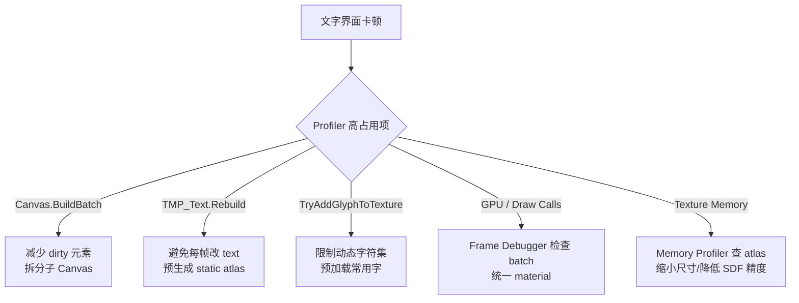

# 性能优化与调试

> 所属计划: [[plan|Unity 字体系统学习计划]]
> 预计耗时: 60 min
> 前置知识: [[04-sdf-rendering-and-shaders|SDF 渲染与 Shader 特效]], [[05-text-layout-and-mesh-generation|文本布局与网格生成管线]], [[06-dynamic-fonts-fallbacks-localization|动态图集、Fallback 链与本地化]]

---

## 1. 概念讲解

文字渲染看起来只是"把字符串画到屏幕上"，但当字符串频繁变化、语言字符集庞大、特效叠加时，它很容易成为 CPU 与 GPU 的双重瓶颈。想要优化，必须先分清钱花在哪儿。

### 为什么需要性能优化？

Unity 中一个 `TMP_Text.text = "..."` 的赋值，远不是"改个字符串"那么简单。它可能触发：

1. **字符串解析**：富文本标签、转义字符、`<link>` 等需要逐字符扫描。
2. **Glyph 查找**：每个字符要在 Font Asset 的 character/glyph table 中定位；缺字时还要遍历 fallback 链。
3. **动态光栅化**：如果 font asset 是 Dynamic 模式且字符不在图集中，需要调用字体引擎生成新 glyph 并写入 atlas texture。
4. **布局计算**：换行、对齐、字距、基线、顶点颜色都需要重算。
5. **网格重建**：生成新的 quad 顶点、UV、颜色，提交给 `CanvasRenderer` 或 UI Toolkit renderer。
6. **GPU 绘制**： draw call、overdraw、atlas 采样、片元着色器特效。

前几章分别讲解了 SDF、布局与动态图集。本章把这些串起来，从" measured cost "的角度给出可落地的规则。

### 核心思想

性能优化围绕两条主线：

- **减少 CPU 上不必要的重建**：让文字尽可能"静止"，或减少每次变化时需要重新计算的范围。
- **减少 GPU 上的绘制与采样开销**：降低 draw call、overdraw 和 texture memory。

下面先把成本拆开。

#### CPU 成本来源

| 阶段 | 触发条件 | 典型症状 | 优化方向 |
|------|----------|----------|----------|
| 字符串解析与 Tag 处理 | 每次 `text` 改变且启用富文本 | `TMP_Text.ParseInputText` 占用高 | 关闭 `Rich Text`；预解析或拆分文本 |
| Glyph 查找与 Fallback 链 | 字符不在主 asset， fallback 链很长 | `TextCoreFontEngine` / `GetGlyph` 出现 | 缩短 fallback 链；预烘焙常用字符 |
| 动态图集光栅化 | Dynamic asset 遇到新字符 | `TryAddGlyphToTexture`、`LoadFontFace` 尖峰 | 使用 Static asset 或预加载字符集 |
| 布局与网格生成 | 任何使 text dirty 的修改 | `TMP_Text.Rebuild`、`GenerateText` | 避免每帧修改；拆分为小组件 |
| Canvas / UI Toolkit 重建 | UI 系统每帧收集 dirty elements | `Canvas.BuildBatch`、`UIElements.Repaint` | 减少 dirty 范围；使用子 Canvas |

#### GPU 成本来源

| 项目 | 说明 | 检查工具 |
|------|------|----------|
| Draw Call | 不同 material、不同 texture、不同 rect clipping 都会打断 batch | Frame Debugger |
| Overdraw | 文字叠加 Outline、Shadow、Glow 时，同一像素会被多次着色 | Frame Debugger 的 Overdraw 模式 |
| Fill-rate | 大段文字覆盖高分辨率屏幕时，片元数量巨大 | GPU Profiler |
| Atlas Memory | SDF32、2048×2048 图集、多个 fallback asset 会显著增加显存 | Memory Profiler |

#### Batching 规则

uGUI / TextMeshPro UI 文字与 UI Toolkit 文字的 batch 机制不同，混用时要分别考虑：

- **uGUI / TMP UI (`TextMeshProUGUI`)**：
  - 位于同一 Canvas 下、使用同一 material（同一 atlas + 同一 shader variant + 同一 stencil/clip 状态）的文字可以合批。
  - 修改任意一个 `Graphic` 的 color、material、rect 会让该元素标记为 dirty，Canvas 重新 batch；频繁变化会触发 `Canvas.BuildBatch`。
  - 3D `TextMeshPro`（非 UI）不参与 Canvas batch，每个 renderer 通常一个 draw call。
  - `Raycast Target = true` 不影响 batch，但会增加 `GraphicRaycaster` 的 CPU 开销；不交互的文字应关闭。

- **UI Toolkit (`Label`)**：
  - 同一 Panel（同一 `PanelSettings`）内的元素可以 batch；不同 Panel 之间不 batch。
  - `PanelSettings` 的 `Atlas Subdivision` 与动态图集策略影响内存与 batch 能力。
  - 参考 [[06-dynamic-fonts-fallbacks-localization|动态图集、Fallback 链与本地化]] 中的 UI Toolkit 图集配置。

#### 实用规则清单

- **避免每帧更新 `text`**：计数器、计时器只在数值变化时更新；动画文字考虑用 vertex color / shader 实现，而不是改字符串。
- **关闭 `Best Fit`**：它会反复尝试字号、重新布局，并且可能触发动态图集重采样。固定字号 + 预生成所需字号 static atlas 是更稳的方案。
- **预生成 Static Atlas**：对菜单、剧情、HUD 等固定文本，把字符集在 build 前烘焙进 static font asset，运行时不再光栅化。
- **按 Material 分组**：使用同一 atlas 和 material preset 的文字放一起；不同 outline/shadow 设置会生成不同 material，破坏 batch。
- **控制 Fallback 链长度**：fallback 是顺序查找，链越长，缺字时 CPU 成本越高。CJK/emoji 应使用分层 fallback，而不是一条长链。
- **限制动态图集字符集**：对聊天、输入框等真正动态的内容，使用小尺寸动态图集 + 常用字预加载，避免大图集爆炸。
- **拆分大段文本**：单组件顶点数过高会增加网格重建成本；多组件分批更新也更利于脏区管理。
- **慎用 Outline / Shadow / Glow**：每个效果都会增加几何体或片元复杂度。移动端尤甚。
- **为不交互文字关闭 `Raycast Target`**：减少 `GraphicRaycaster` 的遍历开销。

### 调试与 Profile 工具

#### Unity Profiler（CPU / GPU）

- 在 Editor 中打开 **Window > Analysis > Profiler**，选择 **CPU Usage** 模块。
- 搜索关键词：
  - `TMP_Text` / `TextGenerator.GenerateText`：网格生成。
  - `Canvas.BuildBatch` / `CanvasRenderer.Sync`：UI Canvas 重建与提交。
  - `TextCoreFontEngine` / `FontEngine.LoadFontFace` / `TryAddGlyphToTexture`：动态光栅化。
  - `UIElements.Repaint` / `UIR.DrawChain`：UI Toolkit 渲染。
- 在 **GPU** 模块中观察 `Draw Calls`、`SetPass Calls`、`Vertices`。

#### Frame Debugger

- **Window > Analysis > Frame Debugger** 可以逐 draw call 查看场景。
- 检查文字是否被合批：如果两个 TMP 文本之间插入了其他 material 的物体，batch 会被打断。
- 使用 **Overdraw** 模式检查文字特效是否造成大量重叠绘制。

#### Memory Profiler

- 使用 **Memory Profiler** 包抓取快照，筛选 `Texture2D`，查找名字含 `Atlas` 或字体名的资源。
- 关注：
  - **Size**：atlas 尺寸与格式（SDF 通常 `Alpha8` 或 `R8`，color 图集可能是 `RGBA32`）。
  - **Referenced By**：确认哪些 Font Asset / PanelSettings 持有该 texture，避免重复加载。
  - **Dynamic Atlas Group**：动态图集可能会自动扩容，内存持续增长。

#### 一个判断流程


---

## 2. 代码示例

下面是一个可以在场景中直接运行的 benchmark 组件。它会在指定父节点下创建 `N` 个 `TextMeshProUGUI` 实例，周期性地改变文字，并通过 `Profiler.BeginSample` / `EndSample` 在 Profiler 中留下自定义标记，方便对比 **static atlas** 与 **dynamic atlas** 的行为差异。

```csharp
using UnityEngine;
using UnityEngine.Profiling;
using TMPro;

public class TextPerformanceBenchmark : MonoBehaviour
{
    [Header("场景设置")]
    [SerializeField] private TMP_Text textPrefab;
    [SerializeField] private Transform textRoot;

    [Header("Benchmark 参数")]
    [SerializeField] private int instanceCount = 50;
    [SerializeField] private float changeInterval = 0.1f;
    [SerializeField] private bool forceImmediateRebuild = true;

    [Header("字体对比")]
    [SerializeField] private TMP_FontAsset staticFont;
    [SerializeField] private TMP_FontAsset dynamicFont;
    [SerializeField] private BenchmarkMode mode = BenchmarkMode.StaticAtlas;
    [SerializeField] private float alternateInterval = 5f;

    [Header("字符池")]
    [Tooltip("static atlas 中已包含的字符")]
    [SerializeField] private string staticCharPool = "ABCDEFGHIJKLMNOPQRSTUVWXYZ0123456789";
    [Tooltip("用来给 dynamic atlas 施压的字符，最好不在 static atlas 中")]
    [SerializeField] private string dynamicStressPool = "压力测试动态图集性能abcdefghijklmnopqrstuvwxyz";

    public enum BenchmarkMode
    {
        StaticAtlas,
        DynamicAtlas,
        Alternate
    }

    private TMP_Text[] _texts;
    private System.Random _rng = new System.Random(42);
    private float _changeTimer;
    private float _alternateTimer;
    private bool _usingStatic = true;
    private int _updateCount;

    void Start()
    {
        if (textPrefab == null)
        {
            Debug.LogError("[TextBenchmark] 请在 Inspector 中赋值 textPrefab。");
            return;
        }
        if (textRoot == null)
            textRoot = transform;

        _texts = new TMP_Text[instanceCount];
        TMP_FontAsset initialFont = mode == BenchmarkMode.DynamicAtlas ? dynamicFont : staticFont;

        for (int i = 0; i < instanceCount; i++)
        {
            TMP_Text t = Instantiate(textPrefab, textRoot);
            t.font = initialFont;
            t.fontSize = 36;
            t.alignment = TextAlignmentOptions.Center;
            t.enableWordWrapping = false;
            t.richText = false;
            t.overflowMode = TextOverflowModes.Overflow;

            // 对 UI 文本关闭 raycast target，减少不必要的点击检测开销
            if (t is TextMeshProUGUI uiText)
                uiText.raycastTarget = false;

            t.text = Sample(staticCharPool, 8);
            _texts[i] = t;
        }

        Debug.Log($"[TextBenchmark] 已创建 {instanceCount} 个 TMP 文本，模式：{mode}");
    }

    void Update()
    {
        if (_texts == null || _texts.Length == 0)
            return;

        // 在 Alternate 模式下定时切换字体 asset，观察 static / dynamic 的差异
        if (mode == BenchmarkMode.Alternate)
        {
            _alternateTimer += Time.unscaledDeltaTime;
            if (_alternateTimer >= alternateInterval)
            {
                _alternateTimer = 0f;
                _usingStatic = !_usingStatic;
                SwitchFont(_usingStatic ? staticFont : dynamicFont);
                Debug.Log($"[TextBenchmark] 切换到 {(_usingStatic ? "Static" : "Dynamic")} font");
            }
        }

        _changeTimer += Time.unscaledDeltaTime;
        if (_changeTimer < changeInterval)
            return;
        _changeTimer = 0f;

        bool useStaticPool = (mode == BenchmarkMode.StaticAtlas) ||
                             (mode == BenchmarkMode.Alternate && _usingStatic);
        string pool = useStaticPool ? staticCharPool : dynamicStressPool;
        string sampleName = useStaticPool ? "TextBenchmark_SetText_Static" : "TextBenchmark_SetText_Dynamic";

        Profiler.BeginSample(sampleName);
        for (int i = 0; i < instanceCount; i++)
        {
            _texts[i].text = Sample(pool, 8);

            // 强制立即重建网格，把光栅化/布局成本体现在当前 sample 中
            if (forceImmediateRebuild)
                _texts[i].ForceMeshUpdate(true, true);
        }
        Profiler.EndSample();

        _updateCount++;
        if (_updateCount % 50 == 0)
        {
            Debug.Log($"[TextBenchmark] 已更新 {_updateCount} 轮，每轮 {instanceCount} 个文本。" +
                      $"请查看 Profiler 中的 {sampleName} 标记。");
        }
    }

    private void SwitchFont(TMP_FontAsset font)
    {
        if (font == null) return;
        for (int i = 0; i < _texts.Length; i++)
            _texts[i].font = font;
    }

    private string Sample(string pool, int length)
    {
        char[] buffer = new char[length];
        for (int i = 0; i < length; i++)
            buffer[i] = pool[_rng.Next(pool.Length)];
        return new string(buffer);
    }

    void OnDestroy()
    {
        if (_texts == null) return;
        for (int i = 0; i < _texts.Length; i++)
        {
            if (_texts[i] != null)
                Destroy(_texts[i].gameObject);
        }
    }
}
```
**运行方式:**

1. 新建 Unity 2021.3 LTS（或更新版本）项目，确保已安装 **TextMeshPro** 包。
2. 在场景中创建 **Canvas**，并在其下创建一个 `TextMeshProUGUI` 作为 prefab：
   - `GameObject > UI > Text - TextMeshPro`。
   - 调整好字号、颜色后拖到 Project 窗口做成 prefab，删除场景中的实例。
3. 准备两个 Font Asset：
   - **Static**：在 Font Asset Creator 中把 `staticCharPool` 里的字符预烘焙进去。
   - **Dynamic**：创建时选择 **Source Font File**，**Atlas Population Mode** 设为 `Dynamic`。
4. 新建空物体，挂载 `TextPerformanceBenchmark.cs`：
   - `Text Prefab`：拖入刚才制作的 TMP 预制体。
   - `Text Root`：拖入 Canvas 或一个空父节点。
   - `Static Font` / `Dynamic Font`：分别拖入两个 Font Asset。
5. 打开 **Window > Analysis > Profiler**，选择 **CPU Usage** 模块。
6. 进入 Play Mode，观察 Profiler 中 `TextBenchmark_SetText_Static` 与 `TextBenchmark_SetText_Dynamic` 的耗时差异。

**预期输出:**

```text
[TextBenchmark] 已创建 50 个 TMP 文本，模式：StaticAtlas
[TextBenchmark] 已更新 50 轮，每轮 50 个文本。请查看 Profiler 中的 TextBenchmark_SetText_Static 标记。
[TextBenchmark] 已更新 100 轮，每轮 50 个文本。请查看 Profiler 中的 TextBenchmark_SetText_Static 标记。
```
切换到 `DynamicAtlas` 或 `Alternate` 模式后，Profiler 中通常会出现：

- `TextBenchmark_SetText_Dynamic` 平均耗时更高，且伴随尖峰。
- 尖峰帧里出现 `TextCoreFontEngine.TryAddGlyphToTexture` 或 `FontEngine.LoadFontFace`，说明动态图集正在光栅化新字符。
- 运行一段时间后，dynamic 模式趋于平稳（字符都已缓存），但如果 `dynamicStressPool` 字符足够多，可能会触发 atlas 扩容，再次出现尖峰。

---

## 3. 练习

### 练习 1: 统一材质以减少 Draw Call

扩展 `TextPerformanceBenchmark`，让其中一半文本使用 material A，另一半使用 material B。运行场景后打开 **Frame Debugger**，记录两种配置下的 batch / draw call 数量。然后把两组文本改为使用**同一个 material preset**，再次记录并解释差异。

> 提示：TMP 的 material preset 可以在 Font Asset 的 `Material Presets` 中创建，确保两组使用同一 atlas。

### 练习 2: 用 Profiler 对比 Static / Dynamic Atlas

修改 benchmark，使其在 `Alternate` 模式下每切换一次字体 asset 就输出一行日志，记录：

- 当前是 Static 还是 Dynamic。
- 最近 `N` 帧内 `TextBenchmark_SetText_*` sample 的最大耗时。
- 是否观察到 `TryAddGlyphToTexture` 或 `LoadFontFace` 样本。

请写出采集与输出逻辑，并说明为什么 dynamic atlas 在"首次出现新字符"时会产生尖峰。

### 练习 3: 制作一个 Atlas 内存检查工具（可选）

编写一个 Editor 窗口（继承 `UnityEditor.EditorWindow`），列出当前已加载的所有 `TMP_FontAsset`，显示：

- 名称。
- `atlasPopulationMode`。
- `atlasTexture` 的宽度、高度、格式。
- 估算显存占用（`width * height * bytesPerPixel`）。

运行后分析：同一份字体同时存在 Static 与 Dynamic 两个超大图集时，内存会浪费多少？

---

## 3.5 参考答案

> [!tip]- 练习 1 参考答案
> 关键思路：在 `Start()` 中实例化文本后，根据索引分别赋值 `materialForRendering` 或创建时使用不同 material preset。示例片段：
>
> ```csharp
> [SerializeField] private Material materialA;
> [SerializeField] private Material materialB;
>
> for (int i = 0; i < instanceCount; i++)
> {
>     TMP_Text t = Instantiate(textPrefab, textRoot);
>     t.font = staticFont;
>     t.fontSharedMaterial = (i % 2 == 0) ? materialA : materialB;
>     // ...
> }
> ```
>
> 打开 Frame Debugger 后通常会看到：使用两种 material 时，文字被拆成至少 2 个 batch；统一 material 后（且在同一 Canvas、无 clip 差异），所有文字可能合为 1 个 batch。注意：如果 text color 不同但 material 相同，TMP 会通过顶点颜色实现，通常仍可以合批；如果改的是 `material.color`，则会打断 batch。

> [!tip]- 练习 2 参考答案
> 采集逻辑可以使用 `ProfilerRecorder` 或自定义采样；最简单的做法是在每次 `Update` 循环中记录 `Time.unscaledTime` 差值：
>
> ```csharp
> private float _sampleStart;
> private float _maxSampleMs;
> private int _sampleFrames;
>
> void Update()
> {
>     // ... 切换逻辑 ...
>     _sampleStart = Time.unscaledTime;
>     Profiler.BeginSample(sampleName);
>     for (int i = 0; i < instanceCount; i++)
>     {
>         _texts[i].text = Sample(pool, 8);
>         if (forceImmediateRebuild)
>             _texts[i].ForceMeshUpdate(true, true);
>     }
>     Profiler.EndSample();
>     float ms = (Time.unscaledTime - _sampleStart) * 1000f;
>     _maxSampleMs = Mathf.Max(_maxSampleMs, ms);
>     _sampleFrames++;
>
>     if (_sampleFrames >= 100)
>     {
>         Debug.Log($"[Benchmark] 模式 {mode}/{_usingStatic} 最近 100 帧最大耗时：{_maxSampleMs:F2} ms");
>         _maxSampleMs = 0f;
>         _sampleFrames = 0;
>     }
> }
> ```
>
> Dynamic atlas 首次遇到新字符时，需要：
> 1. 从源字体文件加载 glyph 轮廓；
> 2. 计算 SDF（或 bitmap）；
> 3. 将结果写入 atlas texture（会触发 `Texture2D.SetPixels` / `Apply`）；
> 4. 更新 Font Asset 的 glyph table。
> 这些步骤都会体现在 Profiler 的 `TextCoreFontEngine` / `Texture2D.Apply` 中，因此形成尖峰。一旦字符被缓存，后续只涉及 mesh 重建，耗时大幅下降。

> [!tip]- 练习 3 参考答案（可选）
> 一个最小的 EditorWindow 示例：
>
> ```csharp
> using UnityEditor;
> using UnityEngine;
> using TMPro;
>
> public class FontAtlasMemoryWindow : EditorWindow
> {
>     [MenuItem("Tools/Font Atlas Memory")]
>     static void Open() => GetWindow<FontAtlasMemoryWindow>("Font Atlas Memory");
>
>     private Vector2 _scroll;
>
>     void OnGUI()
>     {
>         _scroll = GUILayout.BeginScrollView(_scroll);
>         var fonts = Resources.FindObjectsOfTypeAll<TMP_FontAsset>();
>         foreach (var font in fonts)
>         {
>             var tex = font.atlasTexture;
>             if (tex == null) continue;
>             int bpp = GetBytesPerPixel(tex.format);
>             long bytes = (long)tex.width * tex.height * bpp;
>             GUILayout.Label($"{font.name}: {tex.width}x{tex.height} {tex.format} ~{bytes / 1024 / 1024} MB ({font.atlasPopulationMode})");
>         }
>         GUILayout.EndScrollView();
>     }
>
>     int GetBytesPerPixel(TextureFormat fmt)
>     {
>         switch (fmt)
>         {
>             case TextureFormat.Alpha8:
>             case TextureFormat.R8: return 1;
>             case TextureFormat.RGBA32:
>             case TextureFormat.ARGB32:
>             case TextureFormat.BGRA32: return 4;
>             case TextureFormat.RGBAFloat: return 16;
>             default: return 4;
>         }
>     }
> }
> ```
>
> 分析：如果同一份字体同时保留 2048×2048 Static 和 2048×2048 Dynamic，仅两张 `Alpha8` atlas 就占用约 `2 × 2048 × 2048 × 1 = 8 MB`；若是 `RGBA32` 彩色图集，则高达 32 MB。对移动端项目，应只保留真正需要的 variant，或在运行时按需加载/卸载。

> [!note] 答案使用方式
> 先独立完成练习，再展开查看参考答案。参考答案不是唯一解——如果你的实现通过了测试或达到了题目要求，就是正确的。

---

## 4. 扩展阅读

- [TextMeshPro Font Asset Creator](https://docs.unity3d.com/Packages/com.unity.textmeshpro@3.2/manual/FontAssetsCreator.html)
- [TextMeshPro About SDF fonts](https://docs.unity3d.com/Packages/com.unity.textmeshpro@3.2/manual/FontAssetsSDF.html)
- [TextMeshPro Fallback font assets](https://docs.unity3d.com/Packages/com.unity.textmeshpro@3.2/manual/FontAssetsFallback.html)
- [TextMeshPro Shaders](https://docs.unity3d.com/Packages/com.unity.textmeshpro@3.2/manual/Shaders.html)
- [UI Toolkit Text best practices](https://docs.unity3d.com/Manual/best-practice-guides/ui-toolkit-for-advanced-unity-developers/text.html)
- [Unity Profiler documentation](https://docs.unity3d.com/Manual/Profiler.html)
- [Unity Frame Debugger](https://docs.unity3d.com/Manual/FrameDebugger.html)
- [Unity Memory Profiler package](https://docs.unity3d.com/Packages/com.unity.memoryprofiler@1.1/manual/index.html)
- [UnityCsReference TextGenerator.cs](https://github.com/Unity-Technologies/UnityCsReference/blob/master/Modules/TextCoreTextEngine/Managed/TextGenerator.cs)

---

## 常见陷阱

- **错误**：在 `Update()` 里每帧给 TMP 文本赋新字符串做动画或计时器。\
  **正确做法**：只在数值变化时更新；动画尽量用 shader vertex color 或材质属性，避免触发解析/布局/网格重建。

- **错误**：开启 `Best Fit` 以适配不同分辨率。\
  **正确做法**：预生成常用字号 static atlas，或使用 Layout Group + 固定字号；`Best Fit` 会反复重排并可能触发动态图集更新。

- **错误**：对大量不交互的 TMP UI 文本保持 `Raycast Target = true`。\
  **正确做法**：不接收点击/悬停的文字一律关闭 `Raycast Target`，减少 `GraphicRaycaster` 每帧开销。

- **错误**：所有文字使用不同 material 或不同 outline 颜色。\
  **正确做法**：使用同一 atlas 的 material preset，把相同样式的文本放一起；需要多样式时优先通过顶点颜色或同一 shader 变体实现。

- **错误**：为支持多语言把全球字符都塞进一个 dynamic atlas。\
  **正确做法**：按语言拆分 static fallback asset，动态图集只保留聊天/输入框真正会出现的字符，并预加载常用字。

- **错误**：3D `TextMeshPro` 文字数量不加控制，期望像 UI 一样 batch。\
  **正确做法**：3D TMP 不参与 Canvas batch，每个对象通常独立 draw call；远距离/小字尽量合并为静态贴图或控制数量。

- **错误**：在移动端使用 SDF32 + 2048×2048 图集追求极致清晰。\
  **正确做法**：移动端优先 SDFAA 或 SDF8，512×512 / 1024×1024 通常足够；大标题可单独使用高精度 asset。

- **错误**：UI Toolkit 中把 UI 分散在多个 `PanelSettings` 下还期望合批。\
  **正确做法**：同一功能模块的文字尽量放在同一 Panel / PanelSettings 下，并参考 UI Toolkit 的 batch 与 atlas 设置。

- **错误**：滥用 Outline + Shadow + Glow，移动端 fill-rate 爆炸。\
  **正确做法**：关键标题才用复杂特效；普通说明文字用纯色或简单描边；必要时把效果预渲染到 sprite。
