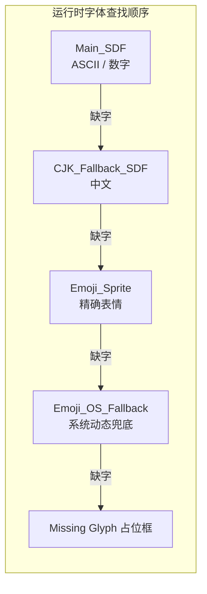

# 综合项目：多语言游戏 HUD 文字方案

> 所属计划: [[plan|Unity 字体系统学习计划]]
> 预计耗时: 120 min
> 前置知识: [[01-text-rendering-fundamentals|文字渲染基础]]、[[02-unity-text-systems-overview|Unity 三大文字系统]]、[[03-font-asset-creation-and-internals|Font Asset 创建与内部结构]]、[[04-sdf-rendering-and-shaders|SDF 渲染与 Shader 特效]]、[[05-text-layout-and-mesh-generation|文本布局与网格生成管线]]、[[06-dynamic-fonts-fallbacks-localization|动态图集、Fallback 链与本地化]]、[[07-performance-optimization|性能优化与调试]]、[[08-custom-effects-and-advanced-topics|自定义 Shader、Sprite Asset 与高级主题]]

---

## 1. 概念讲解

前面八个章节分别拆开了 Unity 字体系统的各个部件。本章把它们拼装成一个完整项目：为一款支持中英文 + emoji 的游戏 HUD 设计字体资产方案，并写出可在真机上运行的管理代码。

### 为什么需要这个？

一个典型 RPG HUD 会同时出现：

- **血量/伤害数字**：频繁变化，要求清晰、缩放不糊。
- **任务日志**：中英双语，长文本，需要按稀有度变色。
- **聊天输入框**：玩家输入任意字符，不可预测。
- **Emoji 图标**：🗡️、❤️、⚠️ 等表情符号。

如果把所有字形都塞进同一张动态图集，会带来三个问题：

1. **图集爆炸**：CJK 常用字几千个，emoji 成百上千，动态生成会不断扩容。
2. **内存不可控**：一张 4096×4096 的 SDF 图集在低端机上可能直接爆显存。
3. **回退顺序错乱**：中文 fallback 和 emoji fallback 如果顺序不对，会出现中文显示成 emoji 或方块。

因此需要把字符按**使用频率、可预测性、语言归属**分层，分别做成 static/dynamic/sprite/OS fallback。

### 核心思想

| 文本类型 | 推荐资产 | 模式 | 理由 |
|----------|----------|------|------|
| 血量/伤害数字 | 主 SDF 字体 | Static | 数字、字母、标点固定且少，预烘焙质量高 |
| 任务日志中文 | CJK 专用字体 | Static | 常用 3500 字可预估，避免运行时动态生成 |
| Emoji 图标 | Sprite Asset / Dynamic OS | Static + Dynamic | 精确控制用 Sprite；兜底用 OS 动态字体 |
| 聊天输入 | 主字体 + 分层 fallback | Dynamic | 不可预测输入交给 fallback 链处理 |

分层之后，运行时按当前语言选择**主字体**，再挂载 fallback 链。TMP 缺字时会自动按顺序查找：

```text
主字体 → Fallback 链 → Sprite Asset → 全局 Fallback → 默认字体 → Missing Glyph
```
> [!note] 与 UI Toolkit 的关系
> 本项目示例使用 **uGUI + TextMeshPro**，因为它在移动和 PC 上最常用。若你使用 UI Toolkit，核心思路完全一致：为 `Label` 配置 `Font Asset` 与 `fallback`，并用 `PanelSettings` 控制 batch。区别只在于 API 入口不同。

---

## 2. 项目规格与资产策略

### 2.1 HUD 元素清单

| 元素 | 文本示例 | 需求 |
|------|----------|------|
| 血量数字 | `HP 1280 / 1500` | 大号、动态变化、颜色随血量变化 |
| 伤害飘字 | `-128` | 瞬时生成、可被对象池回收 |
| 任务标题 | `[稀有] 消灭史莱姆` | 稀有度颜色（白/绿/蓝/紫/橙） |
| 任务描述 | `前往森林深处，击败 5 只史莱姆。` | 中英双语、正文小字 |
| 聊天输入 | 玩家自由输入 | 任意字符，需要输入框对象池 |
| 快捷表情 | `❤️🗡️⚠️` | 与文字同行显示 |

### 2.2 字体资产策略

推荐准备以下 4 个资产：

1. **`Main_SDF.asset`**：主字体，包含 ASCII + 数字 + 常用标点。Atlas 1024×1024，Static，Padding 5，Sampling 48。
2. **`CJK_Fallback_SDF.asset`**：中文字体，包含常用 3500 字（可用字符集文件批量导入）。Atlas 2048×2048，Static。
3. **`Emoji_Sprite.asset`**：TMP Sprite Asset，把 emoji 图集做成 sprite，Unicode 匹配。
4. **`Emoji_OS_Fallback.asset`**（可选）：Atlas Population Mode 设为 **Dynamic OS**，作为 emoji 兜底。


### 2.3 材质预设策略

同一个 SDF atlas 可以生成多个 `Material Preset`，只改 `_FaceColor`、`_OutlineColor` 等属性，不复制 atlas。这样不同稀有度/血量状态共享同一份贴图和 draw call。

---

## 3. 代码示例

下面给出一个可运行的最小实现，包含：

- `HudFontProfile`：集中描述字体资产和稀有度配色。
- `MultilingualHudFontManager`：运行时切换语言、统一赋值、切换血量材质。
- `HudFontProfileEditor`：Editor 工具一键生成 fallback 链和材质预设。
- `ChatInputPool`：聊天输入框对象池，限制动态图集污染。

### 3.1 字体配置资产

```csharp
using System.Collections.Generic;
using TMPro;
using UnityEngine;

[CreateAssetMenu(fileName = "HudFontProfile", menuName = "HUD/Font Profile")]
public class HudFontProfile : ScriptableObject
{
    [Tooltip("主字体：拉丁/数字/英文/常用标点")]
    public TMP_FontAsset mainFont;

    [Tooltip("按顺序排列的 fallback 字体，通常是 CJK、emoji OS fallback")]
    public List<TMP_FontAsset> fallbackChain = new List<TMP_FontAsset>();

    [Tooltip("Emoji Sprite Asset，用于精确控制表情")]
    public TMP_SpriteAsset emojiSpriteAsset;

    [Tooltip("主字体的基础材质，用于生成稀有度 preset")]
    public Material baseMaterial;

    [Tooltip("稀有度颜色配置")]
    public List<RarityPreset> rarityPresets = new List<RarityPreset>();
}

[System.Serializable]
public class RarityPreset
{
    public string name;
    public Color faceColor = Color.white;
}
```
### 3.2 HUD 字体管理器

```csharp
using System.Collections.Generic;
using TMPro;
using UnityEngine;

public class MultilingualHudFontManager : MonoBehaviour
{
    public static MultilingualHudFontManager Instance { get; private set; }

    [SerializeField] private HudFontProfile profile;
    [SerializeField] private TMP_Text healthText;
    [SerializeField] private List<TMP_Text> hudTexts = new List<TMP_Text>();

    private readonly HashSet<TMP_Text> _registered = new HashSet<TMP_Text>();
    private string _currentLocale = "en";

    void Awake()
    {
        if (Instance != null && Instance != this)
        {
            Destroy(gameObject);
            return;
        }
        Instance = this;

        foreach (var t in hudTexts)
            if (t != null) _registered.Add(t);
        if (healthText != null) _registered.Add(healthText);
    }

    public void Register(TMP_Text text)
    {
        if (text != null) _registered.Add(text);
    }

    public void Unregister(TMP_Text text)
    {
        if (text != null) _registered.Remove(text);
    }

    public void SetLocale(string locale)
    {
        _currentLocale = locale;
        TMP_FontAsset font = PickFontForLocale(locale);
        TMP_SpriteAsset sprite = profile != null ? profile.emojiSpriteAsset : null;

        foreach (var text in _registered)
        {
            if (text == null) continue;
            text.font = font;
            text.spriteAsset = sprite;
            text.SetAllDirty();
        }

        Debug.Log($"[HUD Font] Locale switched to {locale}, font={font.name}");
    }

    private TMP_FontAsset PickFontForLocale(string locale)
    {
        // CJK 语言直接以 CJK 字体为主，避免大量缺字触发 fallback。
        if ((locale == "zh" || locale == "ja" || locale == "ko") &&
            profile != null && profile.fallbackChain.Count > 0)
        {
            return profile.fallbackChain[0];
        }

        return profile != null ? profile.mainFont : null;
    }

    public void UpdateHealthColor(float percent)
    {
        if (healthText == null || profile == null) return;

        Material mat = null;
        foreach (var rarity in profile.rarityPresets)
        {
            bool match = percent switch
            {
                < 0.3f => rarity.name == "Danger",
                < 0.7f => rarity.name == "Warning",
                _      => rarity.name == "Healthy",
            };

            if (match)
            {
                mat = FindPresetMaterial(rarity.name);
                break;
            }
        }

        if (mat != null)
        {
            healthText.fontSharedMaterial = mat;
            healthText.SetAllDirty();
        }
    }

    private Material FindPresetMaterial(string rarityName)
    {
        // 材质预设与 profile 放在同一目录下，命名约定：MainFont_RarityName
        string matName = $"{profile.mainFont.name}_{rarityName}";
        return Resources.Load<Material>($"Fonts/{matName}");
    }
}
```
### 3.3 Editor 工具：一键生成 Fallback 链与材质预设

```csharp
#if UNITY_EDITOR
using System.Collections.Generic;
using TMPro;
using UnityEditor;
using UnityEngine;

public static class HudFontProfileEditor
{
    [MenuItem("Tools/HUD Font/Apply Profile")]
    public static void ApplyProfile()
    {
        var profile = Selection.activeObject as HudFontProfile;
        if (profile == null)
        {
            Debug.LogError("请在 Project 窗口选中一个 HudFontProfile 资产。");
            return;
        }

        BuildFallbackChain(profile);
        BuildMaterialPresets(profile);

        AssetDatabase.SaveAssets();
        Debug.Log("[HUD Font] Profile applied: fallback chain & material presets ready.");
    }

    private static void BuildFallbackChain(HudFontProfile profile)
    {
        if (profile.mainFont == null) return;

        profile.mainFont.fallbackFontAssetTable.Clear();
        foreach (var fallback in profile.fallbackChain)
        {
            if (fallback != null && fallback != profile.mainFont)
                profile.mainFont.fallbackFontAssetTable.Add(fallback);
        }

        EditorUtility.SetDirty(profile.mainFont);
    }

    private static void BuildMaterialPresets(HudFontProfile profile)
    {
        if (profile.baseMaterial == null || profile.rarityPresets == null) return;

        string profilePath = AssetDatabase.GetAssetPath(profile);
        string folder = System.IO.Path.GetDirectoryName(profilePath).Replace('\\', '/');

        foreach (var rarity in profile.rarityPresets)
        {
            string matName = $"{profile.mainFont.name}_{rarity.name}";
            string path = $"{folder}/{matName}.mat";

            // 已存在则更新颜色，否则创建新材质。
            Material mat = AssetDatabase.LoadAssetAtPath<Material>(path);
            if (mat == null)
            {
                mat = new Material(profile.baseMaterial);
                mat.name = matName;
                AssetDatabase.CreateAsset(mat, path);
            }

            mat.SetColor("_FaceColor", rarity.faceColor);
            EditorUtility.SetDirty(mat);
        }
    }
}
#endif
```
### 3.4 聊天输入框对象池

```csharp
using System.Collections.Generic;
using TMPro;
using UnityEngine;

public class ChatInputPool : MonoBehaviour
{
    [SerializeField] private TMP_InputField inputPrefab;
    [SerializeField] private Transform poolRoot;
    [SerializeField] private int maxPoolSize = 8;

    private readonly Queue<TMP_InputField> _pool = new Queue<TMP_InputField>();
    private readonly HashSet<TMP_InputField> _rented = new HashSet<TMP_InputField>();

    public TMP_InputField Rent()
    {
        TMP_InputField item;
        if (_pool.Count > 0)
        {
            item = _pool.Dequeue();
        }
        else
        {
            item = Instantiate(inputPrefab, poolRoot);
        }

        item.text = string.Empty;
        item.gameObject.SetActive(true);
        _rented.Add(item);
        return item;
    }

    public void Return(TMP_InputField item)
    {
        if (item == null || !_rented.Remove(item)) return;

        item.text = string.Empty;
        item.gameObject.SetActive(false);

        if (_pool.Count < maxPoolSize)
            _pool.Enqueue(item);
        else
            Destroy(item.gameObject);
    }
}
```
**运行方式:**

```bash
# 1. 环境
Unity 2022.3 LTS 或更新版本
TextMeshPro 3.0.6+（Package Manager 已内置或手动安装）

# 2. 导入字体
- 准备一款支持 Latin 的 TTF/OTF（如 Source Sans Pro、Roboto）。
- 准备一款支持中文的 TTF/OTF（如 Noto Sans CJK SC、思源黑体）。
- Window > TextMeshPro > Font Asset Creator 分别生成 SDF 资产。
  - Main：Static，字符集 ASCII + 数字 + 标点，Atlas 1024x1024。
  - CJK：Static，字符集常用 3500 字（可用 txt 字符集文件），Atlas 2048x2048。
  - Emoji OS Fallback：Dynamic OS，Atlas 512x512，关闭 Multi Atlas。

# 3. 创建 Sprite Asset（可选但推荐）
- 将表情图集导入为 Sprite，或直接用 TextMeshPro > Sprite Asset Creator。
- 设置 Default Sprite Asset 或在代码中赋值给 TMP_Text.spriteAsset。

# 4. 配置 Profile
- Assets > Create > HUD > Font Profile。
- **将 Profile 放到 `Assets/Resources/Fonts/` 目录下**（与代码中 `Resources.Load` 路径一致）。
- 拖拽 Main、CJK Fallback、Emoji Sprite、Base Material。
- 添加 3 个 RarityPreset：Healthy(绿)、Warning(黄)、Danger(红)。
- 选中 Profile，点击菜单 Tools > HUD Font > Apply Profile。

# 5. 场景设置
- 创建 Canvas，放置 TMP_Text（血量、任务、聊天）。
- 创建空物体挂载 MultilingualHudFontManager，赋值 Profile 和相关文本。
- 运行后调用 MultilingualHudFontManager.Instance.SetLocale("zh") 切换语言。
```
**预期输出:**

```text
[HUD Font] Locale switched to zh, font=CJK_Fallback_SDF
# 视觉上：血量数字随百分比变红/黄/绿；任务中文正常显示；聊天输入任意字符不方块；emoji 显示为图片或系统表情。
```
---

## 4. 练习

### 练习 1: 基础 —— 补全 Fallback 链

假设 `HudFontProfile` 里已经填好了 `mainFont` 和 `fallbackChain`，请补全 `BuildFallbackChain` 方法，要求：

1. 先清空主字体已有的 fallback。
2. 按 `fallbackChain` 列表顺序逐个加入，且不允许把自己加给自己。
3. 修改完成后标记 `SetDirty` 并保存。

### 练习 2: 进阶 —— 按语言自动选择材质预设

扩展 `MultilingualHudFontManager.SetLocale`，让中文环境下所有 **任务标题** 自动使用稀有度为 `Epic` 的材质预设（紫色），英文环境下使用 `Common`（白色）。

提示：

- 给 `TMP_Text` 加上 Tag（如 `tag == "QuestTitle"`）来区分任务标题。
- 用 `FindPresetMaterial("Epic")` 获取预设。

### 练习 3: 挑战 —— 限制聊天输入动态图集尺寸

为 `ChatInputPool` 增加初始化逻辑：运行时用 `TMP_FontAsset.CreateFontAsset` 创建一个 **512×512、Dynamic、关闭 Multi Atlas** 的专用输入字体，并把它赋给池里所有 `TMP_InputField` 的 `font`。要求不改变主字体图集。

---

## 4.5 参考答案

> [!tip]- 练习 1 参考答案
> ```csharp
> private static void BuildFallbackChain(HudFontProfile profile)
> {
>     if (profile.mainFont == null) return;
>
>     profile.mainFont.fallbackFontAssetTable.Clear();
>     foreach (var fallback in profile.fallbackChain)
>     {
>         if (fallback != null && fallback != profile.mainFont)
>             profile.mainFont.fallbackFontAssetTable.Add(fallback);
>     }
>
>     EditorUtility.SetDirty(profile.mainFont);
>     AssetDatabase.SaveAssets();
> }
> ```

> [!tip]- 练习 2 参考答案
> ```csharp
> public void SetLocale(string locale)
> {
>     _currentLocale = locale;
>     TMP_FontAsset font = PickFontForLocale(locale);
>     TMP_SpriteAsset sprite = profile != null ? profile.emojiSpriteAsset : null;
>
>     // 语言决定默认稀有度
>     string defaultRarity = locale == "zh" ? "Epic" : "Common";
>     Material defaultPreset = FindPresetMaterial(defaultRarity);
>
>     foreach (var text in _registered)
>     {
>         if (text == null) continue;
>         text.font = font;
>         text.spriteAsset = sprite;
>
>         if (text.CompareTag("QuestTitle") && defaultPreset != null)
>             text.fontSharedMaterial = defaultPreset;
>
>         text.SetAllDirty();
>     }
> }
> ```

> [!tip]- 练习 3 参考答案
> ```csharp
> [SerializeField] private Font inputSourceFont; // 源 TTF
> private TMP_FontAsset _inputFont;
>
> void Start()
> {
>     _inputFont = TMP_FontAsset.CreateFontAsset(
>         inputSourceFont,
>         36,                              // sampling point size
>         4,                               // padding
>         GlyphRenderMode.SDFAA,
>         512, 512,                        // atlas 尺寸上限
>         AtlasPopulationMode.Dynamic,
>         enableMultiAtlasSupport: false   // 禁止扩容
>     );
>
>     // 把输入字体加入主字体 fallback，作为输入兜底。
>     if (MultilingualHudFontManager.Instance?.profile?.mainFont != null)
>         MultilingualHudFontManager.Instance.profile.mainFont.fallbackFontAssetTable.Add(_inputFont);
> }
>
> public TMP_InputField Rent()
> {
>     var item = _pool.Count > 0 ? _pool.Dequeue() : Instantiate(inputPrefab, poolRoot);
>     item.text = string.Empty;
>     item.fontAsset = _inputFont;
>     item.gameObject.SetActive(true);
>     _rented.Add(item);
>     return item;
> }
> ```

> [!note] 答案使用方式
> 先独立完成练习，再展开查看参考答案。参考答案不是唯一解——如果你的实现通过了测试或达到了题目要求，就是正确的。

---

## 5. 验收标准（自我测试）

完成项目后，用以下清单逐项验证：

| 检查项 | 通过标准 |
|--------|----------|
| 主字体图集 | 仅包含 ASCII + 数字 + 标点，容量 ≤ 1024×1024 |
| CJK fallback | 常用 3500 字无方块，fallback 顺序在主字体之后、emoji 之前 |
| Emoji 显示 | `❤️🗡️⚠️` 在文本中正常渲染（Sprite 或 OS fallback） |
| 语言切换 | 调用 `SetLocale("zh")` / `SetLocale("en")` 后所有 HUD 文本刷新 |
| 材质预设 | 血量 0–30% 红色、30–70% 黄色、70–100% 绿色 |
| 输入池 | 连续打开/关闭 20 次聊天框，未产生新的 GameObject 峰值 |
| 动态图集 | 聊天专用字体 atlas 不超过 512×512，且未污染主字体图集 |
| Profiler | Frame Debugger 中 HUD 文字 batch 数 ≤ 3（同材质预设可合批） |

---

## 6. 扩展阅读

- [TextMeshPro Fallback font assets](https://docs.unity3d.com/Packages/com.unity.textmeshpro@3.2/manual/FontAssetsFallback.html)
- [TextMeshPro Material Presets](https://docs.unity3d.com/Packages/com.unity.textmeshpro@3.2/manual/MaterialPresets.html)
- [TextMeshPro Sprite Asset](https://docs.unity3d.com/Packages/com.unity.textmeshpro@3.2/manual/Sprites.html)
- [UI Toolkit Text best practices](https://docs.unity3d.com/Manual/best-practice-guides/ui-toolkit-for-advanced-unity-developers/text.html)
- [[06-dynamic-fonts-fallbacks-localization|动态图集、Fallback 链与本地化]]
- [[07-performance-optimization|性能优化与调试]]

---

## 常见陷阱

- **错误**: 把 CJK fallback 放在 emoji fallback 之后。
  **正确做法**: fallback 顺序应为 `主字体 → CJK → Emoji Sprite → OS fallback`，避免中文被错误解析成 emoji。

- **错误**: 动态图集开启 `Multi Atlas Support` 且不限制尺寸。
  **正确做法**: 对玩家输入等不可控文本使用独立的小尺寸动态字体（512×512），并关闭 `Multi Atlas`。

- **错误**: 直接修改 `fontMaterial`（返回实例材质）做稀有度颜色。
  **正确做法**: 使用 `fontSharedMaterial` 或预先生成 Material Preset，避免每个文本产生独立 material 导致无法 batch。

- **错误**: 运行时反复 `Instantiate` / `Destroy` 输入框。
  **正确做法**: 用对象池复用 `TMP_InputField`，返回时清空 `text` 并 `SetAllDirty`。

- **错误**: 把中文主字体直接作为全局字体给所有文本使用。
  **正确做法**: 英文场景用 Latin 主字体，中文场景切换到 CJK 字体，只有在缺字时才走 fallback，减少图集内存。

- **错误**: 修改了 Font Asset 的 fallback 链但没有 `SetDirty` / `SaveAssets`。
  **正确做法**: Editor 工具修改 ScriptableObject 或 Font Asset 后必须调用 `EditorUtility.SetDirty` 和 `AssetDatabase.SaveAssets`，否则下次打开项目会丢失配置。
