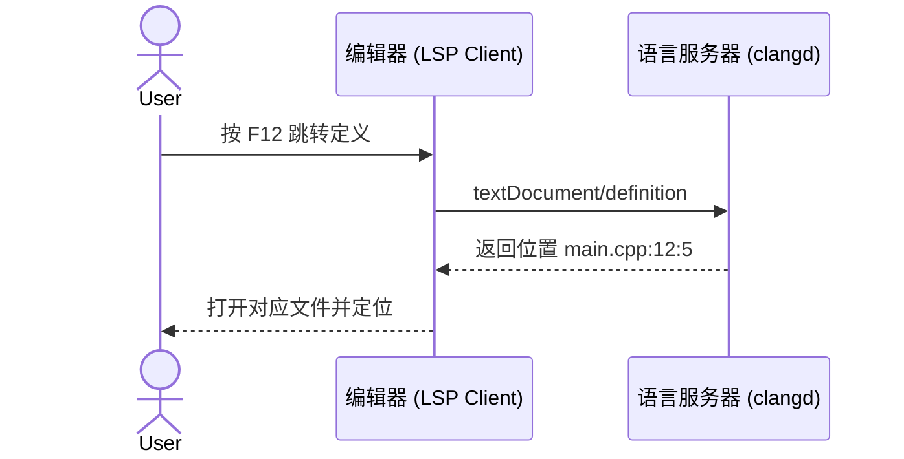

# clangd 环境与核心概念

> [!info] 本节信息
> 所属计划: [[plan]]
> 预计耗时: 50min
> 前置知识: [[01-environment-setup]]

---

## 1. 概念讲解

### 为什么需要这个？

写 C++ 时，编辑器需要回答很多问题：

- 这个符号是什么类型？
- 按 `F12` 能跳转到哪里？
- 输入 `.` 或 `->` 之后该补全什么成员？
- 这行代码有没有语法或类型错误？

这些功能都叫「语言智能」。问题是，每个编辑器（VS Code、Vim、Emacs、Sublime……）都重复实现一遍 C++ 分析器太浪费，而且容易出错。于是 LSP 把这件事拆成两层：

- **编辑器（客户端）**：只负责展示、输入、调用命令。
- **语言服务器（后端）**：专门负责理解代码，返回补全、跳转、诊断等结果。



### 核心思想

**clangd 是 LLVM/clang 项目提供的 C/C++ 语言服务器。** 它用 clang 前端去「解析」你的源码，但**不生成可执行文件**——它的产物是编辑器能理解的补全列表、跳转位置、诊断信息等。

这意味着两件事：

1. **clangd 不是编译器**。`g++` 负责把代码变成程序；clangd 负责让编辑器更聪明。两者可以共存，职责不同。
2. **clangd 必须知道「这个文件该怎么编译」**。它要知道 `-std` 版本、`-I` 头文件搜索路径、宏定义、系统头位置等。如果信息缺失或错误，clangd 就会按默认配置硬猜，结果往往是满屏红波浪线、补全不准、跳转失败。

因此，clangd 项目通常需要配合 `compile_commands.json` 或 `compile_flags.txt`，把真实编译参数同步给 clangd。这两者的区别和生成方式会在 [[08-compile-commands]] 中详细展开。

### clangd 与 g++ 的关系

你的构建命令可能长这样：

```bash
g++ -std=c++17 -I./include -DSP_VERSION=2 src/main.cpp -o main
```

clangd 并不执行这条命令，但它需要知道同样的参数，否则解析出来的结果就会和实际编译不一致。尤其注意：

- **标准库头路径不同**：g++ 用的是 GCC 的头文件，clangd 默认可能找不到或找到另一套。
- **内置宏不同**：g++ 和 clang 的预定义宏不完全一样。
- **`--query-driver` 的作用**：让 clangd 去询问某个编译器（如 `/usr/bin/g++`）的系统头路径，从而尽量和真实构建对齐。

一句话总结：

> `g++` 负责「正确构建」，clangd 负责「正确理解」；两者目标一致，但实现不同，需要你把编译信息喂给 clangd。

---

## 2. 命令示例

### 安装 clangd

#### Windows

推荐用 MSYS2（如果你已经按 [[01-environment-setup]] 装好 MSYS2）：

```bash
pacman -S mingw-w64-ucrt-x86_64-clang-tools-extra
```

或者下载 LLVM 官方 Windows 安装包，安装时勾选 `clangd`，然后把安装目录下的 `bin` 目录（例如 `C:\tools\llvm\bin`）加入系统 `PATH`。

#### macOS

```bash
brew install llvm
```

> [!warning] 注意
> Homebrew 安装的 `llvm` 默认不在 `PATH` 中，安装完成后按终端提示添加：
> ```bash
> export PATH="/opt/homebrew/opt/llvm/bin:$PATH"
> ```
> 也可以直接使用 Xcode 自带的 clangd，路径通常在 `/Applications/Xcode.app/Contents/Developer/Toolchains/XcodeDefault.xctoolchain/usr/bin/clangd`。

#### Linux

```bash
# Debian / Ubuntu
sudo apt install clangd

# Fedora
sudo dnf install clang-tools-extra

# Arch
sudo pacman -S clang
```

### 验证安装

新开一个终端，运行：

```bash
clangd --version
```

预期输出类似：

```text
clangd version 18.1.8 (https://github.com/llvm/llvm-project.git 3b5b5c1ec4a4025)
Features: windows+grpc
Platform: x86_64-w64-windows-gnu
```

> [!tip] 提示
> 版本号不重要，关键是终端能找到 `clangd`。如果提示「找不到命令」，先检查 `PATH` 是否配置正确。

### 用 `--check` 诊断单文件

`--check` 是排查 clangd 行为的第一工具。它让 clangd 按项目配置解析一个文件，并打印出它看到的包含路径、宏、诊断等信息。

```bash
clangd --check=main.cpp
```

典型输出片段：

```text
I[06:26:00.000] clangd version 18.1.8
I[06:26:00.000] Working directory: D:\AI\AI_Learning\demo
I[06:26:00.000] ASTWorker building file main.cpp
I[06:26:00.000] Compile command from compile_commands.json is:
  D:\msys64\ucrt64\bin\g++.exe -std=c++17 -I./include -c main.cpp
E[06:26:00.001] [missing_include] 'myheader.h' file not found
```

如果文件解析成功，最后会打印类似 `All diagnostics emitted.` 的信息。如果有错，它会明确标出是哪一步出错，比如找不到头文件、标准版本不对、宏缺失等。

### 常用命令行 flag

这些 flag 既可以在命令行里用，也可以在编辑器配置里通过 `clangd.arguments` 传入。

| flag                    | 作用                                                       |
| ----------------------- | -------------------------------------------------------- |
| `--background-index`    | 在后台为整个项目建立索引，提升跨文件跳转/引用查找速度                              |
| `--clang-tidy`          | 开启 `clang-tidy` 静态检查规则                                   |
| `--log=verbose`         | 输出详细日志，排查配置问题时很有用                                        |
| `--query-driver=<路径模式>` | 允许 clangd 查询指定编译器的系统头路径，例如 `--query-driver=/usr/bin/g++` |
| `-j=N`                  | 后台索引使用 `N` 个线程，例如 `-j=8`                                 |
| `--pch-storage=memory`  | 把预编译头缓存放到内存，加速但占用更多 RAM                                  |

> [!warning] 注意
> `--query-driver` 的「路径模式」通常写绝对路径，也可以用通配符。例如 `--query-driver=/usr/bin/g++,/usr/local/bin/g++*`。Windows 上 MSYS2 的 g++ 路径类似 `C:\msys64\ucrt64\bin\g++.exe`。

### 最简配置：compile_flags.txt

如果你的项目没有 CMake 或 Makefile，可以写一个 `compile_flags.txt`，放在项目根目录。每行一个编译 flag：

```text
-std=c++17
-Wall
-I./include
-DMY_DEBUG
```

clangd 会自动读取同一目录及子目录下所有 C++ 文件，并用这些 flag 去解析它们。例如目录结构：

```text
demo/
├── compile_flags.txt
├── include/
│   └── utils.hpp
└── main.cpp
```

这样 `main.cpp` 在 clangd 看来就是按 `-std=c++17 -Wall -I./include -DMY_DEBUG` 编译的。

> [!info] 说明
> `compile_flags.txt` 适合只有几个源文件的小项目。工程化项目推荐用 `compile_commands.json`，详情请见 [[08-compile-commands]]。

---

## 3. 扩展阅读

- [clangd 官方文档](https://clangd.llvm.org/)
- [clangd 配置参考](https://clangd.llvm.org/config)
- [Language Server Protocol 规范](https://microsoft.github.io/language-server-protocol/)
- 继续学习：[[08-compile-commands]]

---

## 常见陷阱

- **clangd 解析用的标准库头路径与 g++ 实际编译不一致** → 使用 `--query-driver` 指向你的 g++ 可执行文件，让 clangd 询问正确的系统头路径。
- **没有喂编译信息，导致满屏红波浪线** → 小项目用 `compile_flags.txt`，大项目用 `compile_commands.json`，确保 clangd 拿到和真实构建一致的 flag。
- **编辑器报「clangd 未找到」** → 先在新终端运行 `clangd --version`，确认 `PATH` 已配置；Windows 用户注意要「新开」终端或重启编辑器以加载新的环境变量。
- **知道 clangd 报错却不知道原因** → 先用 `clangd --check=文件名.cpp` 看诊断输出，这是最直接的排查入口。
- **误以为 clangd 能替代 g++ 构建项目** → clangd 只产生语言服务信息，不生成 `.o` 或可执行文件，构建仍由 `g++` 或构建系统负责。
