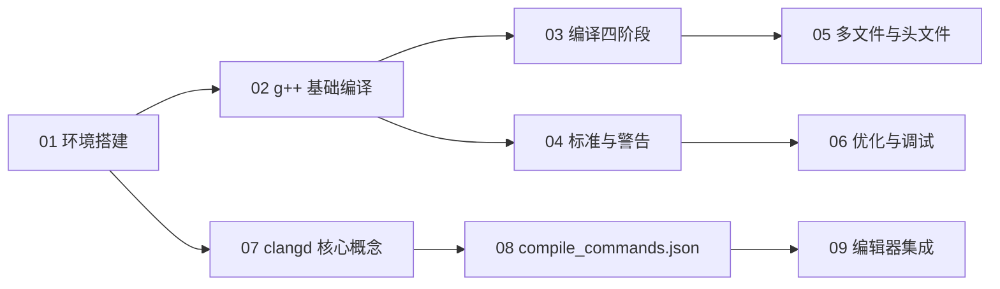

# 教程索引

> 本计划的 9 节教程，按知识依赖关系排序。g++ 在前（编译器），clangd 在后（编辑器智能）。

## g++ 编译器

| 序号 | 知识点 | 文件 |
|------|--------|------|
| 01 | 环境搭建 | [[01-environment-setup]] |
| 02 | g++ 基础编译 | [[02-gpp-basic-compilation]] |
| 03 | g++ 编译四阶段 | [[03-gpp-compilation-stages]] |
| 04 | g++ 标准与警告 | [[04-gpp-standards-warnings]] |
| 05 | g++ 多文件与头文件 | [[05-gpp-multiple-files]] |
| 06 | g++ 优化与调试 | [[06-gpp-optimization-debugging]] |

## clangd 语言服务器

| 序号 | 知识点 | 文件 |
|------|--------|------|
| 07 | clangd 环境与核心概念 | [[07-clangd-fundamentals]] |
| 08 | 生成 compile_commands.json | [[08-compile-commands]] |
| 09 | clangd 编辑器集成与配置 | [[09-clangd-editor-integration]] |

## 学习路径图

> [!note] 路径说明
> g++ 部分（`01`-`06`）与 clangd 部分（`07`-`09`）在 [[01-environment-setup]] 之后可并行学习，但建议先完整学完 g++ 再进入 clangd——理解编译命令是配置 clangd 的前提。
